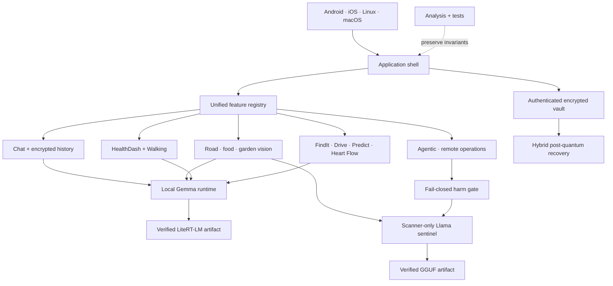

# Naza One

[](https://github.com/ornab74/naza_one_generation_ui_code/actions/workflows/flutter-release.yml)
[](https://github.com/ornab74/naza_one_generation_ui_code/actions/workflows/windows-store-msix.yml)

**Naza One is a private, local-first Flutter AI workstation built around on-device Gemma + LiteRT-LM and a separate scanner-only Llama safety sentinel.** It combines local chat, vision, road/safety scanning, food intelligence, agentic development tools, encrypted memory, hardened local storage, hybrid post-quantum recovery, verified model delivery, and cross-platform desktop/mobile builds without requiring a cloud chat backend.

> **Microsoft Store:** https://apps.microsoft.com/detail/9nm382wsvsvn
>
**What's new in v1.0.11?**

v1.0.11.
It includes:
Unified feature wheel and desktop rail
Knowledge Vault, Memory Observatory, Projects, and Workflow Builder
Garden logging, image intelligence, and charts
Food workspace and kitchen trend improvements
HeartFlow six-dimension simulation
Chess and memory games
Security, encrypted backup, and post-quantum recovery improvements

## Current security and agentic-runtime update

The repository includes a dedicated scanner-only model as a **probabilistic
harm filter**. It is deliberately separate from Chat and cannot be selected as
a conversational model.

- A verified, CPU-only LlamaDart runtime loads the exact
  `llama3-small-Q3_K_M.gguf` artifact.
- First-run model preparation now requires both the Gemma chat model and the
  safety-sentinel model before the application is considered model-ready.
- Privileged-operation prompts contain only a normalized semantic command
  identifier, bounded CPU/RAM telemetry, and the locally derived L-state. They
  never contain shell arguments, payloads, paths, hostnames, CIDs, repository
  contents, credentials, chat history, or user prompts.
- Any `High` result denies the operation. Invalid output, model unavailability,
  inference failure, or timeout also denies the operation.
- Deterministically destructive command classes remain hard-denied without
  relying on model authorization.
- DigitalOcean lifecycle actions, remote SSH/execution routes, container work,
  IPFS publish/pull/RPC operations, BookForge GitHub scan/pull/publish, and
  non-Chat frontier-provider egress are gated immediately before side effects.
- Stored approval is not a reusable bypass: remote-operation transitions are
  checked again at approval and dispatch time.
- Road and Food/Water scanners use the same small model for repeated risk
  classification and authoritative risk/score-band calibration. Chat remains
  on Gemma and does not call the sentinel.
- IPFS and GitHub adapters retain independent validation, authorization, and
  transport protections; the probabilistic model is a defense-in-depth veto,
  not a capability issuer.

Detailed contract: [Probabilistic harm filter](docs/probabilistic-harm-filter.md)


## Architecture and LLM maintenance map

The repository uses explicit, reviewable breadcrumbs for future maintainers and language models. It does **not** contain hidden prompts, zero-width tokens, or covert model instructions.

- [LLM context and security breadcrumb schema](docs/llm-context-schema.md)
- [Documentation policy](docs/documentation-policy.md)
- [System architecture](docs/system-architecture.md)
- [Unified feature navigation architecture](docs/feature-navigation-architecture.md)
- [Security change playbook](docs/security-change-playbook.md)
- [Complete repository file catalog](docs/file-catalog.md)
- [Complete repository folder catalog](docs/folder-catalog.md)
- [All Mermaid architecture maps](docs/mermaid-index.md)
- [Naza One system handbook](docs/naza-one-handbook.md)
- [Security model](SECURITY.md)



Folder maps: [application](lib/mermaid.md) · [chat](lib/chat/mermaid.md) · [food](lib/food/mermaid.md) · [memory](lib/memory/mermaid.md) · [model runtime](lib/model/mermaid.md) · [navigation](lib/navigation/mermaid.md) · [onboarding](lib/onboarding/mermaid.md) · [scanner](lib/scanner/mermaid.md) · [security](lib/security/mermaid.md) · [settings](lib/settings/mermaid.md) · [themes](lib/theme/mermaid.md) · [tests](test/mermaid.md) · [Android](android/mermaid.md) · [iOS](ios/mermaid.md) · [Linux](linux/mermaid.md) · [macOS](macos/mermaid.md) · [native](native/mermaid.md) · [assets](assets/mermaid.md) · [tooling](tool/mermaid.md).

## Core idea

Naza One keeps the assistant and user-created state as close to the user as practical. Normal inference runs locally. History, memory, scanner state, settings, onboarding state, and selected-model metadata are stored locally with authenticated encryption. Model files are public model data, so they are integrity-protected rather than encrypted.

There is no developer-operated conversation server, no advertising SDK, no behavioral analytics SDK, no required user account, and no microphone/voice-generation pipeline.

## First-run experience

The executable entrypoint is now **vault first**, not model first.

```text
lib/main.dart
    |
    v
NazaBootCoordinator
    |
    +-- 1. encrypted vault setup / unlock
    +-- 2. verified Gemma + sentinel model setup
    +-- 3. skippable AI + feature guide
    +-- 4. theme selection
    +-- 5. pre-load Gemma runtime
    |
    v
Chat ready to use
```

### 1. Encryption first

A fresh install always creates the encrypted local vault before model acquisition.

The default UX is intentionally low-friction:

- **vault encryption is always on**;
- **startup password is off by default**;
- the default passwordless path generates a random unlock secret and stores it in the operating system secure credential store;
- the first-run checkbox is phrased as an opt-in: **“Require a password every time Naza One starts”**;
- enabling it switches the startup gate to Argon2id-derived password protection;
- secure-storage failure is fail-closed rather than silently writing an equivalent plaintext key.

Existing password-protected vaults still request their password. Installs containing older encrypted records are routed through the original authenticated migration path so legacy data is verified before cleanup.

### 2. Advanced model setup

The second screen is the local-model setup surface. It prepares two
independently verified artifacts: Gemma for Chat/explanatory generation and the
small Llama sentinel for scanners and privileged-operation vetoes. It exposes a
real multi-source chunked downloader with live progress rather than a decorative
progress bar.

The UI shows:

- received / total bytes;
- chunk completion;
- active transfer count;
- current throughput;
- fastest observed provider;
- verification stage;
- **Pause** and **Resume** controls.

Pause is cooperative and real: active response streams are back-pressured and new chunks stop being scheduled. Completed chunks remain on disk for later resume. Closing and reopening the app can reuse already-completed chunk state. Gemma and the sentinel are downloaded sequentially through the same bounded 4 MiB transfer machinery and each must pass its own size and SHA-256 identity check.

### Desktop local-model picker

Windows, Linux, and macOS also expose **“Use a local .litertlm model file instead”**.

The native file picker accepts the Gemma model only after the exact expected byte count and pinned SHA-256 match. The selected source path and model identity are then saved inside the encrypted vault. Naza attempts to expose the verified file to the managed model cache using a link/hard-link first to avoid casually duplicating ~2.4 GiB, with a copy fallback when the platform cannot link it. Selecting Gemma locally does not bypass the separate sentinel requirement.

The developer/admin override remains supported:

```bash
export NAZA_MODEL_PATH=/absolute/path/to/gemma-4-E2B-it.litertlm
```

That path does **not** bypass model integrity checks.

### 3. Skippable local guide

The third screen teaches the minimum useful mental model for:

- normal prompting;
- local chat and encrypted Smart Memory;
- vision/image prompts;
- road/safety scanner use;
- fridge, food and bake workflows;
- local-first security boundaries.

The guide is skippable.

### 4. Theme gallery

First run now includes a large theme gallery with dark and light presets including Naza Emerald, Orbital Olive, Cyber Neon, Synthwave, Midnight, Terminal, Ocean Lab, Forest, Ember, Lavender Moon, Graphite, Obsidian Red, Quantum Cyan, Deep Space, Aurora, Plasma, Copper Circuit, Ice Station, Rose Dark, Black Gold, Matrix Rain, Ultraviolet, Solar, Arctic, Paper Mint, Rose Quartz, Open Sky and Desert Paper.

The selected theme is stored in the encrypted vault and restored on later starts.

### 5. AI pre-warm

Before onboarding exits, Naza prepares the selected backend, refreshes model trust, and calls the local Gemma runtime readiness path. The application lands in Chat only after local inference is ready, so the first message does not need to wait through a hidden model-load step.

---

# Local model identity

Current model:

```text
gemma-4-E2B-it.litertlm
```

Immutable Hugging Face revision:

```text
7fa1d78473894f7e736a21d920c3aa80f950c0db
```

Expected bytes:

```text
2,583,085,056
```

Pinned final SHA-256:

```text
ab7838cdfc8f77e54d8ca45eadceb20452d9f01e4bfade03e5dce27911b27e42
```

The GitHub release is split into three equal-size model parts:

| Part | Bytes | SHA-256 |
| --- | ---: | --- |
| `part00.bin` | 861,028,352 | `b4ba4432650a1d767736b4139d9d94ab0ebb2e084a9c1fcca3824e691b4cb995` |
| `part01.bin` | 861,028,352 | `5f27ca28d693292298ce9bff48c641458af2994466cc1809576380b947861bc8` |
| `part02.bin` | 861,028,352 | `00e9d3b99151f41afe9cbc2e99cd3d684b62d67238859285ec89d1cf5a94c2f3` |

Release: https://github.com/ornab74/naza_one_generation_ui_code/releases/tag/v1

## Scanner-only sentinel identity

The safety/scanner model is separately pinned and is never routed into Chat:

```text
filename: llama3-small-Q3_K_M.gguf
revision: naza-sentinel-llama3-small-v1
expected bytes: 111,454,016
SHA-256: 8e4f4856fb84bafb895f1eb08e6c03e4be613ead2d942f91561aeac742a619aa
```

The manifest defines hash-pinned HTTPS sources for GitHub Releases, Hugging
Face, and the configured Pinata IPFS gateway. The transfer engine may select a
healthy source, but no source can change the compiled artifact identity.

The runtime uses a 2,048-token context, CPU backend, four inference/batch
threads, 256-token batch, 128-token micro-batch, memory mapping, and serialized
generation. It verifies the entire GGUF again before loading and unloads it
after an idle period through the same serialized queue used by inference.

Third-party attribution and the GPL-3.0 license are preserved under
[`third_party_licenses/naza-dart-source/`](third_party_licenses/naza-dart-source/).

---

# Multi-source model distribution

Relevant files:

```text
lib/model/model_distribution_manifest.dart
lib/model/runtime_mirror_catalog.dart
lib/model/multiplane_model_downloader.dart
lib/model/pausable_model_downloader.dart
lib/model/local_model_preference.dart
mirrors.md
```

The first-run downloader uses immutable model identity compiled into the app. Runtime mirror discovery may add approved transport locations but cannot change the expected filename, revision, total size, part sizes, part hashes, or final SHA-256.

Current transport families include:

- immutable Hugging Face full-object source;
- GitHub Release parts;
- optional runtime mirrors restricted to those same two host families.

The onboarding transfer engine uses 4 MiB chunks, concurrent range requests, provider scoring, persistent chunk spool state, contiguous-prefix assembly, part hash verification, final full-file SHA-256 verification, and atomic promotion into the managed model location.

[`mirrors.md`](mirrors.md) is both human-readable topology documentation and the optional runtime HTTPS mirror catalog.

---

# Chat

Naza One supports local streaming generation with:

- automatic continuation;
- seam/overlap repair;
- bounded continuation passes;
- context-window recovery;
- image attachment support;
- explicit generation timeouts;
- encrypted history;
- reopenable conversation threads;
- user-aware streaming scroll behavior;
- searchable/pinnable/renameable conversation metadata in the modular chat layer.

Relevant modular files:

```text
lib/chat/advanced_chat_coordinator.dart
lib/chat/history_drawer.dart
lib/chat/history_metadata_repository.dart
lib/chat/scroll_follow_controller.dart
```

---

# Smart local memory

Naza One includes an embedded dependency-free hybrid vector retrieval engine instead of requiring a network vector database.

Default index geometry:

```text
128 dimensions
8 LSH tables
13 LSH bits
2,400 record bound
96 first-stage candidates
```

Retrieval combines deterministic LSH fan-out, one-bit neighbor probing, lexical postings, int8 first-stage similarity, exact cosine reranking, recency, salience, reinforcement, confidence, thread affinity, access signals, and maximal marginal relevance.

The encrypted SQLite vault is the durable source of truth; ANN structures are rebuildable local acceleration data.

Relevant files:

```text
lib/memory/embedded_vector_store.dart
lib/memory/local_memory_service.dart
```

Retrieved memory is treated as potentially stale historical evidence, not as trusted instructions.

---

# Vision, scanner and food intelligence

Vision input is selected/captured deliberately by the user and normalized locally before inference.

The scanner system is evidence-bounded: it separates supplied observations from inference, avoids presenting software transforms as physical sensors, and keeps uncertainty explicit when evidence is incomplete. Road and Food/Water scans run the small local sentinel before the explanatory model. An indeterminate sentinel result fails the scan, and valid sentinel votes control the final risk label, confidence, safety-score range, and safety band so the larger model cannot silently downgrade the small model's classification.

Food modules include fridge analysis, shelf/product workflows, bake analysis/simulation, structured local prompts, image handling, and encrypted saved analyses.

```text
lib/scanner/scanner_surface.dart
lib/food/food_hub.dart
lib/food/models.dart
lib/food/photo_picker.dart
lib/food/prompts.dart
lib/food/repository.dart
lib/food/shelf_scanner.dart
lib/food/bake_simulation.dart
```

Visual AI cannot prove microbiological safety, hidden contamination, internal temperature, or other properties that are not directly evidenced. Use real-world measurements and professional/emergency guidance when stakes require it.

---

# Vault security

See [`SECURITY.md`](SECURITY.md) and [`docs/SECURITY_HARDENING.md`](docs/SECURITY_HARDENING.md).

The vault uses a layered hierarchy:

```text
password OR OS secure-storage unlock secret
              |
              v
        key-encryption key
              |
              v
      wrapped 256-bit VUK
              |
              v
    versioned wrapped DEKs
              |
              v
 AES-256-GCM encrypted records
```

Password mode uses Argon2id. Logical record identifiers are HMAC-derived. Data-key rotation is transactional/resumable. Password changes rewrap key material rather than rewriting every record.

The SQLite container is **record encrypted**, not page encrypted. Schema, approximate row count, ciphertext sizes, key-version identifiers, timestamps, filesystem metadata and similar information can remain observable to someone who obtains the database.

No software-only Flutter/Dart design can guarantee that plaintext actively being used is invisible to a fully privileged live-memory attacker.

---

# Hardened security layer

The repository includes security-state identities and epochs, single-purpose capability leases, rollback detection, forward-evolving audit state, intent/provenance guards, key-guardian abstractions, model/release trust identities, and explicit separation between model suggestions and deterministic application authorization.

Relevant modules:

```text
lib/security/security_kernel.dart
lib/security/security_identity.dart
lib/security/hardened_security_runtime.dart
lib/security/hardened_vault_controller.dart
lib/security/authenticated_rollback_guard.dart
lib/security/persistent_audit.dart
lib/security/intent_guard.dart
lib/security/key_guardian.dart
lib/security/release_trust.dart
lib/security/pq_trust_policy.dart
```

The LLM is never treated as the authority that grants privileged security capabilities.

---

# Probabilistic harm filter

The core sentinel converts typed application operations into stable semantic
names such as `digitalocean.droplet.start`, `ipfs.data.publish`,
`github.data.pull`, or `frontier.road.request`. The caller cannot attach raw
arguments or payloads to this API.

For every decision, the gate samples bounded host telemetry and derives the
L-state values used by the supplied scanner design. It then performs up to five
PUNKD/CHUNKD classification passes and accepts only an exact `Low`, `Medium`, or
`High` response. Cyber-operation policy uses any `High` vote as a veto;
malformed or missing votes fail closed. A `Low` or `Medium` result only permits
the request to continue to the existing deterministic permissions, approval,
validation, quota, and transport checks.

Enforcement currently covers:

- DigitalOcean droplet create/start/stop/delete transitions;
- remote-node start/stop/delete and SSH/check execution routes;
- containerized Chromium/scraping and container-bound work;
- IPFS/Kubo identity, peer, fallback RPC, publish, save, and pull operations;
- BookForge GitHub repository scanning, data pulls, and publishing;
- configured non-Chat remote/frontier model requests; and
- approval and dispatch transitions in the encrypted remote-operation store.

The GitHub adapter validates owner, repository, branch, and path components,
reconstructs raw-content URLs from the validated repository identity, rejects
path traversal, and does not trust an arbitrary API-provided download host. The
IPFS adapter gates immediately before request/socket creation. Secret-free
decision receipts may be stored for audit, while the original command input or
payload never enters the receipt.

Relevant modules:

```text
lib/security/probabilistic_harm_filter.dart
lib/model/sentinel_model_runtime.dart
lib/agentic/remote_operations.dart
lib/agentic/ipfs_chatrooms.dart
lib/agentic/agentic_coding_surface.dart
lib/agentic/agentic_runtime.dart
lib/naza_bookforge.dart
docs/probabilistic-harm-filter.md
```

---

# Hybrid post-quantum recovery

The current maximum recovery profile uses:

- ML-KEM-1024;
- X25519;
- transcript-bound HKDF-SHA-512;
- AES-256-GCM;
- ML-DSA-87 origin signatures;
- an Argon2id-protected private recovery key kit.

Post-quantum cryptography protects long-lived recovery/key-establishment/signature relationships; it is not used as a replacement for AES bulk record encryption.

Legacy ML-KEM-768 recovery packages remain readable through the compatibility path but are not selected for new enrollment.

---

# GPU / CPU runtime policy

Desktop runtime policy supports GPU-first, GPU-only, and CPU-only behavior with explicit backend telemetry and fallback visibility.

Examples:

```bash
NAZA_DESKTOP_CPU=1
NAZA_DESKTOP_GPU=only
```

Strict GPU testing must reject CPU fallback rather than treating a fast CPU result as proof of GPU execution.

Windows development helpers:

```text
tool/prepare_windows_litertlm.ps1
tool/build_windows_modern_gpu.ps1
tool/check_windows_litertlm.ps1
```

A hosted Windows runner can validate build/package reproducibility; physical NVIDIA inference still requires suitable hardware.

---

# Build from source

Clone:

```bash
git clone https://github.com/ornab74/naza_one_generation_ui_code.git
cd naza_one_generation_ui_code
flutter pub get
flutter analyze --no-pub
flutter test --no-pub
```

CI currently uses Flutter `3.44.4`; matching it locally is recommended.

LlamaDart's normal target-specific native bundle is selected through the pinned
`b10075` runtime configuration. Linux x86-64 developers who need to reproduce
the exact optional native source build can run:

```bash
./tool/prepare_linux_llamadart_native.sh
LLAMADART_ALLOW_LEGACY_LOCAL_BUNDLES=1 flutter test --no-pub
```

The helper pins `llamadart-native` commit
`0ba009799d7b88ea2851cff4c273a41aa7137224`, builds CPU-only, checks shared
library dependencies, and never invokes `sudo` or a package manager. Generated
native bundles and source/build trees remain ignored by Git.

### Linux

```bash
sudo apt-get update
sudo apt-get install -y clang cmake ninja-build pkg-config libgtk-3-dev liblzma-dev libsecret-1-dev
flutter build linux --release --no-pub
```

### Android

```bash
flutter build apk --release --no-pub
flutter build appbundle --release --no-pub
```

### Windows

```powershell
flutter build windows --release --no-pub
```

### macOS

```bash
flutter build macos --release --no-pub
```

### iOS unsigned

```bash
flutter build ios --release --no-codesign --no-pub
```

More detail: [`docs/build-all-platforms.md`](docs/build-all-platforms.md)

---

# GitHub Actions: manual only

To reduce CI/CD minutes and artifact storage, the repository intentionally keeps only two workflows and **neither runs automatically**.

### Build Naza One

`.github/workflows/flutter-release.yml`

Trigger: **`workflow_dispatch` only**.

When manually started, you can choose:

```text
all
analyze
android
linux
windows
macos
ios
```

The analyzer/regression-test gate always runs first. Build artifacts are currently retained for only **3 days**.

### Build Microsoft Store MSIX

`.github/workflows/windows-store-msix.yml`

Trigger: **`workflow_dispatch` only**.

It prepares/verifies the Windows LiteRT-LM compatibility runtime, analyzes/tests, builds Windows, creates the Store package, validates the generated Appx manifest, and uploads the MSIX with short artifact retention.

Before submission, follow the [Windows Store release checklist](RELEASE_CHECKLIST.md)
for WACK, privacy disclosures, permissions, accessibility, and clean-install
validation.

So pushes, pull requests and tags do **not** spend Actions minutes by themselves. Run either workflow manually from the GitHub Actions tab when you actually want a build.

---

# Regression coverage

The test suite covers encrypted-database lifecycle, wrong-password handling, ciphertext tamper detection, key rotation, post-quantum recovery, security-state/capability behavior, model bootstrap/integrity, runtime backend policy, continuation logic, scanner contracts, food repositories, vector retrieval, encrypted memory, conversation metadata, onboarding, runtime mirror validation and model-distribution identity.

Sentinel-specific regression coverage verifies:

- prompt/input minimization and exact semantic-name normalization;
- `High`, invalid, unavailable, failed, and timed-out fail-closed behavior;
- deterministic hard-deny command classes and secret-free receipts;
- scanner risk/score/safety-band calibration;
- fresh approval and dispatch checks without state mutation after denial;
- cancellation/serialization behavior around inference and remote operations;
- IPFS publish/pull denial before socket creation;
- GitHub denial before network activity plus raw-host and traversal defenses;
- exact sentinel size/hash identity and dual-model first-run readiness; and
- deliberate exclusion of Chat from the scanner-only runtime.

At the integration handoff, `flutter analyze --no-pub` reported no issues and
the complete Flutter suite passed all 146 tests. No live remote operation or
model download is required by these tests.

New first-run regression guards also assert:

- the product first-run password requirement remains opt-in;
- `main.dart` remains vault-first;
- the theme catalog remains broad and IDs stay unique;
- the model pause gate actually blocks and resumes;
- both GitHub workflows remain manual-only;
- desktop local-model selection remains encrypted-preference + hash gated.

Run manually:

```bash
flutter test --no-pub
```

---

# Project map

```text
.github/workflows/
  flutter-release.yml
  windows-store-msix.yml

lib/
  main.dart
  app.dart
  model_bootstrap.dart

  onboarding/
    boot_coordinator.dart
    boot_theme_catalog.dart
    first_run_onboarding.dart
    onboarding_state.dart

  model/
    model_distribution_manifest.dart
    multiplane_model_downloader.dart
    pausable_model_downloader.dart
    runtime_mirror_catalog.dart
    local_model_preference.dart
    runtime_profile.dart
    sentinel_model_runtime.dart

  chat/
  memory/
  scanner/
  food/
  security/
    probabilistic_harm_filter.dart
  agentic/
    remote_operations.dart
    ipfs_chatrooms.dart
  settings/
  theme/

tool/
docs/
test/
native-bundles/
third_party_licenses/
mirrors.md
SECURITY.md
privacypolicy.md
```

---

# Security non-claims

Naza One does not claim that:

- Dart heap memory is perfectly zeroizable;
- root/admin compromise cannot observe plaintext in use;
- SQLite record encryption hides all database metadata;
- flash storage can always be securely overwritten;
- post-quantum primitives repair a compromised policy engine;
- a probabilistic classifier can prove that an operation is harmless;
- a `Low` or `Medium` sentinel result grants authority or replaces explicit
  permissions, validation, or approval;
- the derived L-state is cryptographic entropy or proof of physical
  non-locality;
- image analysis can prove hidden physical/biological properties;
- hosted CI proves physical NVIDIA execution;
- HTTPS gateway transport is native libp2p/Bitswap.

Precision is part of the security model.

---

# Security reporting

Report suspected vulnerabilities privately to:

**janulisgraylan@gmail.com**

Do not include real passwords, recovery private keys, sensitive user records or private conversation content in public GitHub issues.

Further reading:

- [Security model](SECURITY.md)
- [Hardened security architecture](docs/SECURITY_HARDENING.md)
- [Probabilistic harm-filter contract](docs/probabilistic-harm-filter.md)
- [Privacy policy](privacypolicy.md)
- [Build guide](docs/build-all-platforms.md)
- [Signing guide](docs/github-actions-signing.md)
- [Model mirrors](mirrors.md)
- [Research paper](RESEARCH_PAPER.md)

## Design principle

**Encrypt user state. Verify the model. Keep memory local. Treat model output as data, not authority. Make fallbacks visible. Keep the default experience simple without pretending security properties that are not actually present.**

---

# Feature library

## Chess Agent — advanced Flutter-native port

Chess is a Flutter-native Dart surface available from the unified feature
wheel/sidebar. The implementation follows the referenced
`ornab74/multiverse-generator` contracts without embedding Godot:

- Complete local movement reducer for blocked paths, check, checkmate,
  stalemate, castling, en-passant, and selectable promotion.
- King-capture rejection and self-check filtering; an agent cannot bypass the
  local legal-move boundary.
- Legal destination highlighting, coordinate move identity, bounded move
  history, and snapshot-based undo/redo that restores rights and special-move
  state together.
- Nexus-style prompt contract with `nexus.chess-llm/1` metadata, four modes
  (`opponent`, `tutor`, `chat`, and `style`), bounded 28,000-character input,
  untrusted-data delimiters, legal UCI candidate catalogs, and explicit
  advisory-only output semantics.
- Seven source-aligned skill bands from Explorer through Maximum, sampling
  controls, and the source project's extended playing-style library.
- A deterministic 32-dimensional reducer-derived position vector, stable
  position hash, and CPU three-qubit RGB simulation with amplitudes,
  measurement probabilities, entropy before/after, and entropy gain. These
  values are ranking telemetry only—not physical quantum randomness and never
  a source of move authority.
- Prompt preview metadata, bounded local-memory toggle, responsive Naza theme,
  and the same navigation surface used by mobile and desktop.
- In the app shell, Gemma is the default Black opponent: after a legal player
  move, Naza sends a bounded opponent prompt to the local runtime, retries one
  malformed response, extracts exactly one allowlisted UCI move, and commits it
  only through the local reducer. Model-unavailable or illegal responses stay
  visible as a recoverable status instead of creating a move.

The referenced repository also contains a Godot scene presenter, a separate
authenticated Gemma sidecar, encrypted history/saved-game adapters, and a
larger reducer receipt protocol. This Flutter slice uses Naza's existing local
Gemma runtime directly; persistent saved-game backend integration remains a
separate secure-storage boundary.

## Games portfolio

Games is a dedicated feature-wheel/sidebar destination for playable experiences.
It currently includes:

- **Chess Agent:** Flutter-native deterministic board play with local move history.
- **REV//RECALL:** a Flutter-native sequence-memory game inspired by the referenced RevRecall project, with visual sequence playback, round progression, input validation, failure state, and restart controls.

The portfolio is designed for encrypted local game memory: scores, streaks,
achievements, resumable runs, and per-game statistics can be added without
accounts or remote leaderboards. The current first slice keeps active run state
in memory while the persistence schema is finalized. Planned additions include
daily challenges, agent-vs-player analysis, accessibility modes, replay review,
cross-game achievements, and a local “continue playing” shelf.

This section is the practical map of the product as it exists today. The app is organized around one shared feature rail/wheel and responsive surfaces: mobile uses bottom navigation and drawers, while desktop uses a navigation rail/sidebar. Feature identifiers are allowlisted and configuration stores IDs and settings rather than executable callbacks.

## Chat and assistant modes

The main Chat surface provides local streaming responses from the verified Gemma runtime. It supports:

- General assistant conversations.
- Writer mode for drafting and rewriting.
- Coder mode for technical explanations and code work.
- Visual mode for image-aware prompts.
- Chef mode for cooking and meal planning.
- Mira personality: calm, organized, reflective coaching language.
- Rook personality: direct, structured execution support.
- Orbit personality: exploratory planning and synthesis.
- Streaming partial responses with cancellation and bounded continuation.
- Conversation threads, search, rename, pin, metadata, and history drawer management.
- Image attachments with bounded dimensions and bytes.
- Copyable assistant messages and readable rendering of structured JSON responses.

Structured output is treated as an internal model protocol. The chat bubble converts valid JSON assistant output into readable headings, labels, and bullets instead of exposing raw transport JSON to the user.

## Unified feature wheel and desktop sidebar

The navigation system is shared across mobile and desktop. It supports:

- A central Chat entry.
- Default pins for Chatbot, Road Scanner, and Food Scanner.
- Additional user-configurable pins for Garden, Plant ID, Mushroom ID, Garden Log, FindIt, Drive, Predict, Heart Flow, HealthDash, Walking, BookForge, Chess, Games, Memory, Recipes, Shelf, Food More, Models, Personalities, Memory Settings, Backup & Recovery, History, and settings.
- Food feature entries open their exact workspace directly; Garden entries open the Garden intelligence surface with its image identification and logging tools.
- Long-press/tap pin management on mobile.
- Navigation rail/sidebar configuration on wide layouts.
- Stable allowlisted feature IDs rather than serialized routes or callbacks.
- Pin persistence with rollback if encrypted persistence fails.
- Responsive drawer behavior that keeps mobile and desktop surfaces on the same registry.

## Vision and scanners

### Road Scanner

Road Scanner accepts a camera or gallery image, performs bounded local vision analysis, and presents visible road/safety observations. It is designed to distinguish visible evidence from inference and does not claim hidden mechanical, legal, or biological facts.

### Garden

Garden provides camera capture and image selection for plant/garden workflows. It supports multiple bounded images, local normalization, request details, garden-specific prompt choices, and structured guidance. Image count, per-image bytes, total bytes, and dimensions are bounded before processing.

Garden also includes a lightweight growth journal: users can record a plant name, estimated/measured height and canopy width, save dated observations, and view a two-series growth chart. Image-derived dimensions are estimates and should be confirmed with a ruler or other reference; the journal intentionally labels them as observations rather than biological certainty. Planned extensions include:

- watering, feeding, light, and transplant event markers;
- photo-to-photo timeline comparison with consistent framing guidance;
- pot/bed zones and QR labels for larger gardens;
- weather and growing-degree context supplied by the user;
- reminders for the next observation and anomaly flags for review.

### Food Scanner

Food has a responsive workspace containing:

- Fridge capture from camera, gallery, or files.
- Local image normalization with dimension and byte limits.
- Structured visible-item extraction.
- Use-soon cues, uncertainty reporting, ingredient suggestions, and confidence levels.
- Encrypted fridge and bake history.
- Shelf scanner with focused item review, comparison, risk evidence, and recommendation safeguards.
- Bake workflow with visual/process observations and bounded simulation estimates.
- Explicit safety language: appearance is not proof of freshness, contamination status, doneness, recall status, allergens, or pathogen absence.

### Recipes

Recipes now has its own dedicated Food navigation tab. Users can generate a fresh recipe set from the latest saved fridge inventory without first navigating through the general “More” surface. Each validated recipe can show:

- Title and estimated time.
- Visible ingredients used.
- Missing ingredients.
- Ordered steps.
- Verification notes and uncertainty.

Invalid or incomplete model recipes are rejected by structured parsing instead of being silently converted into instructions.

## Intelligence tools

The feature wheel exposes the following specialized workflows:

- **FindIt:** location-aware search and discovery with explicit location input.
- **Drive:** location-aware driving/planning workflow.
- **Predict:** prediction workflow with required location/context inputs.
- **Heart Flow:** name/username input for personalized prediction context.
- **HealthDash:** schedules, medication tracking, body trends, walking, medication reviews, and health-oriented dashboards.
- **Walking:** activity and walking-oriented health surface.

These workflows use explicit input forms instead of silently relying on missing location, identity, or context. Health and medication outputs are treated as review guidance, not diagnosis or emergency authority.

## BookForge

BookForge is the local writing studio for manuscript creation and publishing. It provides:

- Local Markdown, plain-text, and DOCX import.
- Bounded archive expansion and media extraction.
- New-book creation and metadata editing.
- Library search and book switching.
- Editor mode with debounced encrypted per-document autosave.
- Preview mode with lazy chunked rendering so large manuscripts remain scrollable.
- Embedded media support with bounded import limits.
- Local Gemma generation with cancellation, progress, stale-result protection, and continuation limits.
- OpenAI-compatible provider configuration with endpoint/origin restrictions.
- GitHub repository scanning, download, and publishing support with size,
  identity, path, host, and sentinel checks before network access.
- YAML-safe Markdown publishing metadata.
- Encrypted storage only, including one-time cleanup of legacy preference copies.

BookForge intentionally keeps the editor as the authoritative Markdown surface. Large previews are rendered in lazy text chunks to avoid blocking the Flutter UI thread while switching books or scrolling.

## Agentic and remote operations

The agentic workspace models remote effects as typed records rather than
unstructured executable callbacks. Remote-operation intent is immutable for a
given operation ID, state mutations are serialized, cancellation cannot be
overwritten by a stale in-flight approval, and only secret-free sentinel
receipts are retained for audit.

Supported protected operation families include remote nodes, DigitalOcean
droplets, containerized browser work, IPFS data transfer, GitHub repository
work, and configured frontier-provider routes. Existing per-run approvals,
host-key pinning, encrypted credentials, provider-origin restrictions, and
network permissions remain mandatory independently of the model result.

The IPFS chatroom transport also fixes approval-expiry validation and performs
separate sentinel checks for publish and pull so authorization for one
direction cannot authorize the other.

Additional runtime hardening now requires literal loopback Kubo RPC addresses,
short-lived dispatch approvals, connection/idle/body timeouts,
compression-disabled responses, bounded PubSub line framing, sanitized daemon errors,
validated peer IDs, immutable message identities, and unique sender sequence
numbers. Repository evidence re-resolves every file immediately before opening
it to prevent symlink replacement from escaping the selected root.

Scrape/container plans reject URL credentials, fragments, non-443 ports,
private/local/internal targets, IP literals, and secret-bearing query names.
Every adapter plan carries a rootless, non-root, read-only, no-new-privileges,
drop-all-capabilities, default-seccomp, bounded CPU/memory/PID, no-network-by-
default contract. Remote SSH workspaces must be bounded absolute paths without
traversal or shell metacharacters. A future concrete dispatcher must enforce
these fields at the runtime API; model output is never treated as execution.

## Local memory and history

- Encrypted conversation history and metadata.
- Embedded local vector memory with deterministic retrieval and lexical fallback.
- Bounded record counts, pinned-memory controls, salience, recency, confidence, thread affinity, and diversity-aware retrieval.
- Clear-history flow that clears transcripts, vectors, and conversation metadata.
- Retryable conversation-title generation.
- Serialized metadata writes to prevent stale concurrent saves.

## Models and provider runtime

- Verified Gemma + LiteRT-LM local runtime.
- Separately verified scanner-only Llama + LlamaDart sentinel runtime.
- Pinned model revision, expected size, part hashes, and final SHA-256.
- Pause/resume multi-source model downloads with chunk journals.
- Dual-model onboarding that requires Gemma and the sentinel before readiness.
- Atomic model promotion preserving the last working model on replacement failure.
- Local model-file picker with exact size/hash verification.
- Runtime telemetry that distinguishes initialized GPU, CPU fallback, failure, and unknown/unverified states.
- Secure provider adapter foundation for future remote providers; API keys are stored in encrypted storage, not preferences.
- Custom endpoints are restricted and must not receive secrets unless the provider/origin policy permits them.
- Non-Chat frontier-provider egress is classified by the sentinel before the
  provider request; Chat deliberately remains outside that path.

### Supported inference models

Naza always defaults to the verified local **Gemma 4 E2B** LiteRT-LM model.
The separately verified **Llama 3 Small Q3_K_M sentinel** is internal to safety
and scanner flows and cannot be selected for Chat. Optional remote routing
supports these provider protocols and curated model identifiers:

| Provider | Curated model identifiers |
| --- | --- |
| OpenAI | `gpt-5.6-sol`, `gpt-5.6-terra`, `gpt-5.6-luna`, `gpt-5.2`, `gpt-5.1`, `gpt-5`, `gpt-5-mini`, `gpt-5-nano`, GPT-5 Codex variants, `o3`, `o3-pro`, `o4-mini`, deep-research variants, GPT-4.1 variants, realtime/audio/TTS/transcription variants, `gpt-image-1`, `gpt-oss-120b`, `gpt-oss-20b` |
| Anthropic | `claude-opus-4-1`, `claude-opus-4-0`, `claude-sonnet-4-0`, `claude-3-7-sonnet-latest`, Claude 3.5 Sonnet/Haiku, `claude-3-haiku-20240307` |
| Google Gemini | Gemini 3.x/2.5 Flash and Pro variants, Gemini image/native-audio/TTS, Veo 3.1 preview, deep research preview, `gemini-embedding-2-preview`, `gemini-embedding-001` |
| Meta Muse | `muse-spark-1.2`, `muse-spark-1.1`, `llama-4-maverick`, `llama-4-scout` |
| DigitalOcean Gradient | Kimi, Llama, Qwen, DeepSeek, Claude, OpenAI GPT/o-series, Arcee Trinity, Mistral/Ministral, Nemotron, Gemma, MiniMax, GLM, image/audio/video generation, embedding, and reranker identifiers exposed by the in-app catalog |
| Custom | Any bounded model identifier served by an explicitly configured OpenAI-compatible HTTPS chat-completions endpoint |

The exact picker catalog lives in
[`lib/model/provider_gateway.dart`](lib/model/provider_gateway.dart). Provider
availability, account access, and regional support remain controlled by the
provider; displaying an identifier does not guarantee that an account can use
it. Image, audio, embedding, and generation identifiers may require a
provider-specific API shape and are listed for routing/configuration parity;
the shared text gateway itself uses chat-completions-compatible response text.

### Using a custom inference endpoint

1. Open **Settings → Models / Provider routing** and add a provider profile.
2. Select **Custom OpenAI-compatible**.
3. Enter an HTTPS endpoint that implements the OpenAI-style
   chat-completions request and response shape.
4. Enter its bounded model identifier and API credential, then explicitly
   enable custom-endpoint use.
5. Save the profile. Naza writes the profile and key only to the authenticated
   encrypted vault.
6. Assign that profile to the desired feature route. Features not explicitly
   routed continue to use local Gemma.

Custom endpoints must use HTTPS, cannot contain URL credentials or fragments,
do not follow redirects, and receive bounded JSON requests. Official provider
profiles are restricted to their allowlisted origin on port 443; only the
Custom profile can opt into another HTTPS origin. Responses have an 8 MiB hard
limit and a 45-second gateway timeout.

Before remote model egress, text is normalized, invisible/bidirectional control
characters are removed, and prompt/system lengths are bounded. The outbound
body redacts configured credentials plus recognizable OpenAI, Anthropic,
xAI/Grok, Gemini/Google, DigitalOcean, GitHub, GitLab, Hugging Face, AWS, Slack,
npm, JWT, bearer, API-key, password, and PEM private-key forms.
Endpoint query strings are rejected so credentials cannot be smuggled into the
URL. The selected provider credential is allowed only in its authentication
header and an invariant check rejects any request body still containing it.
Returned remote-model text receives secret redaction and control-character
cleanup before display or encrypted persistence. Local Gemma input/output and
agentic remote-node profile text pass through the shared sanitizer as well.

An enabled custom endpoint is a deliberate trust decision: that server can see
the prompt content sent to it. Vault encryption protects stored configuration
and credentials, not plaintext after the user authorizes transmission to a
remote provider. Never route sensitive features to a server you do not trust.

## Vault, backup, and recovery

- Authenticated encrypted SQLite vault for user state.
- Passwordless OS-secure-key unlock or startup-password unlock.
- Device-key privileged authorization path for passwordless vaults.
- Settings backup/recovery surface for encrypted user data.
- Flash-drive/file backup workflow and cloud-drive integration points.
- Hybrid post-quantum recovery enrollment and separated key-kit/backup artifacts.
- Default-on post-quantum recovery policy with fail-closed downgrade checks.
- Hardened runtime identities for app, model, policy, recovery, and trust roots.
- Protected rollback floor and idempotent migration markers for hardened-state upgrades.
- Bounded export budgets to prevent unbounded plaintext materialization.

The system does not claim that OS secure storage provides a fresh human presence challenge. Device-key authorization proves possession of the OS-protected app key; biometric/PIN user-presence integration remains a separate platform capability.

## Settings and customization

Settings includes:

- Theme gallery and persistent theme selection.
- Model/runtime diagnostics.
- Smart Memory controls.
- Backup and recovery tab.
- Provider/API configuration.
- Feature-wheel pin configuration.
- History and local-data clearing.
- Advanced security and recovery status.

## Build, release, and test protections

- Push and pull-request CI for analysis, normal tests, platform builds, and Store packaging.
- Full normal test suite in the Store release gate.
- Archived release-critical food, security, PQ, audit, and trust tests.
- Immutable GitHub Action commit pins.
- Pinned WiX package version for Windows MSI builds.
- Retry handling for transient native SQLite asset downloads.
- Flutter analyzer and focused security/regression suites run after changes.
## Hardware keys, passkeys, and IPFS signatures

Security-sensitive sign-in and remote-operation flows can use the
`NazaPasskeyPlatform` boundary in `lib/security/hardware_passkey.dart`. Native
adapters must call the operating-system WebAuthn/FIDO2 implementation: Android
Credential Manager, iOS AuthenticationServices, Windows WebAuthn, or Linux
libfido2. The default adapter is deliberately unavailable and fails closed;
raw client assertions are never accepted as verified. Challenges are 256-bit,
single-use, RP- and purpose-bound, expire within two minutes by default, require
user verification, and enforce authenticator counters when the key supplies
one.

Passkeys are not described as post-quantum. For IPFS chat, hardware user
presence can instead be bound into a separate ML-DSA-87 signature. The
`NazaIpfsMlDsa87Signer` signs a canonical, domain-separated transcript covering
the room, sender, ciphertext CID, authenticated-data digest, sequence,
timestamps, attachments, reply reference, and optional passkey proof. Peers
call `verifyAdvancedSignature()` before trusting the envelope. Private signing
keys are never serialized into messages and should be kept in the encrypted
vault or hardware-backed key storage; call `destroy()` when a signer is no
longer needed. IPFS still stores ciphertext only—this is application identity
and message authentication, not an IPFS account or a claim that IPFS itself
provides passkey login.

## Data Pipes / Scraping and progressive security review

Data Pipes is a planning and approval surface, not an unattended cloud
operator. A valid plan is persisted in the encrypted vault and can be handed
to a separately configured adapter. That adapter is the only component allowed
to obtain a DigitalOcean credential, provision a short-lived worker, deploy the
immutable Chromium image, fetch JSONL, and destroy the worker. The plan itself
contains no token, private key, cookie, arbitrary shell, or LLM-generated
Dockerfile. The adapter contract requires robots.txt enforcement, HTTPS and an
explicit domain allowlist, no cookies, pinned `image@sha256`, rootless/read-only
containers, dropped capabilities, no-new-privileges, proxy-only egress, bounded
result bytes/rows, encrypted SQLite ingestion, and teardown after completion.

Successful runs write an encrypted, tamper-evident receipt containing the
canonical plan digest, result digest, row count, worker identity, and execution
timestamps. Returned scraper content is reviewed again after transfer; a
high/critical output finding prevents vault import and still triggers worker
teardown.

`NazaProgressiveSecurityLoop` runs deterministic rule families over agentic
coding output and container manifests. It performs repeated independent passes,
caps findings and input size, sanitizes evidence, preserves a digest of the
reviewed text, and treats high/critical findings as a veto signal. LLM review
can add evidence but cannot lower or delete deterministic findings. The result
is attached to `NazaAgenticRunResult` (`securityDenied`, findings, iteration
count) so future patch/check/container dispatchers can require a clean review
before side effects.
