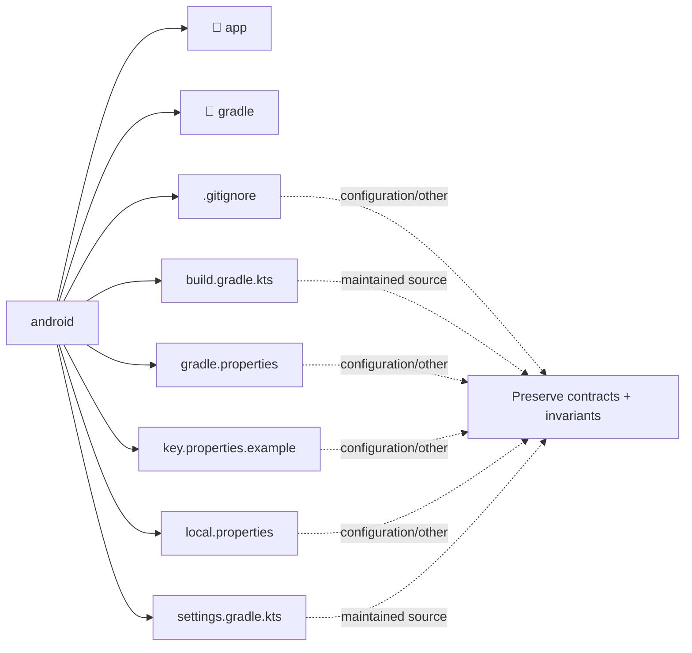

# Architecture Map: `android`

This map is generated by `tool/generate_architecture_docs.py`. It is a navigation aid; executable code and security policy remain authoritative.

## Files

| File | Classification | Purpose |
|---|---|---|
| [`.gitignore`](.gitignore#L1) | configuration/other | Configuration/Other surface for .gitignore. |
| [`build.gradle.kts`](build.gradle.kts#L1) | maintained source | Maintained Source surface for build.gradle. |
| [`gradle.properties`](gradle.properties#L1) | configuration/other | Configuration/Other surface for gradle. |
| [`key.properties.example`](key.properties.example#L1) | configuration/other | Configuration/Other surface for key.properties. |
| [`local.properties`](local.properties#L1) | configuration/other | Configuration/Other surface for local. |
| [`settings.gradle.kts`](settings.gradle.kts#L1) | maintained source | Maintained Source surface for settings.gradle. |

## Change protocol

1. Read the file breadcrumb and `SECURITY.md`.
2. Trace callers, persistence, and async ownership.
3. Preserve bounds and fail-closed behavior.
4. Run analysis and focused tests.
