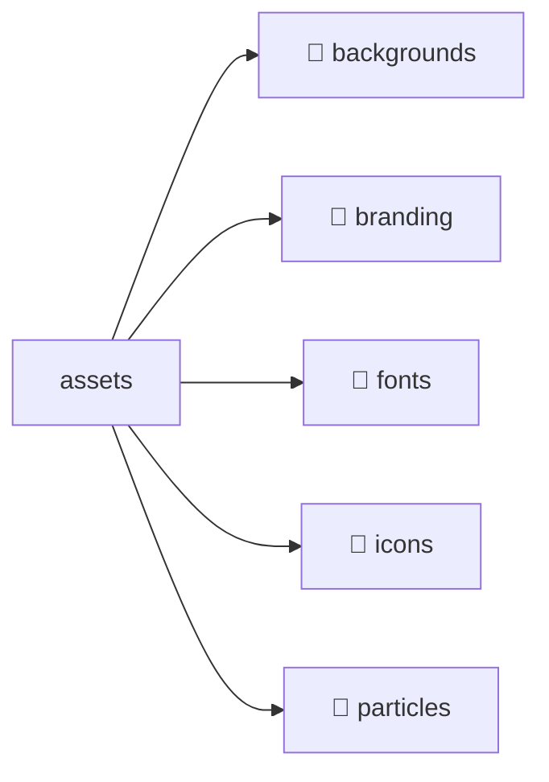

# Architecture Map: `assets`

This map is generated by `tool/generate_architecture_docs.py`. It is a navigation aid; executable code and security policy remain authoritative.

## Files

No direct files; see child folder maps.

## Change protocol

1. Read the file breadcrumb and `SECURITY.md`.
2. Trace callers, persistence, and async ownership.
3. Preserve bounds and fail-closed behavior.
4. Run analysis and focused tests.
