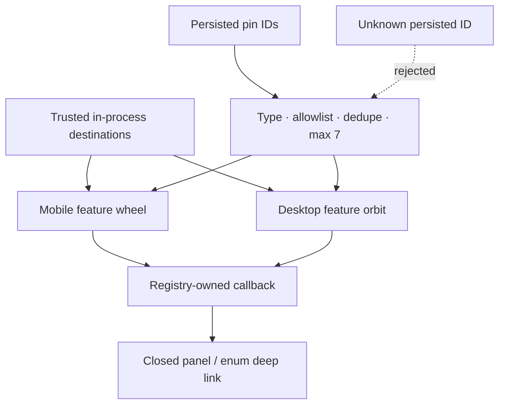

# Unified Feature Navigation

Mobile and desktop consume the same trusted destination registry. User preferences contain a small ordered list of destination IDs only.

Chat is mandatory. Road and Food are seeded pins. Desktop additionally keeps History and Settings as stable anchors for continuity. Long-press pinning never changes destination behavior; it changes presentation order only.

Adding a feature requires one registry entry with a stable ID, static label/category/icon, and an in-process callback. Do not accept arbitrary route strings or reflection-based targets.
