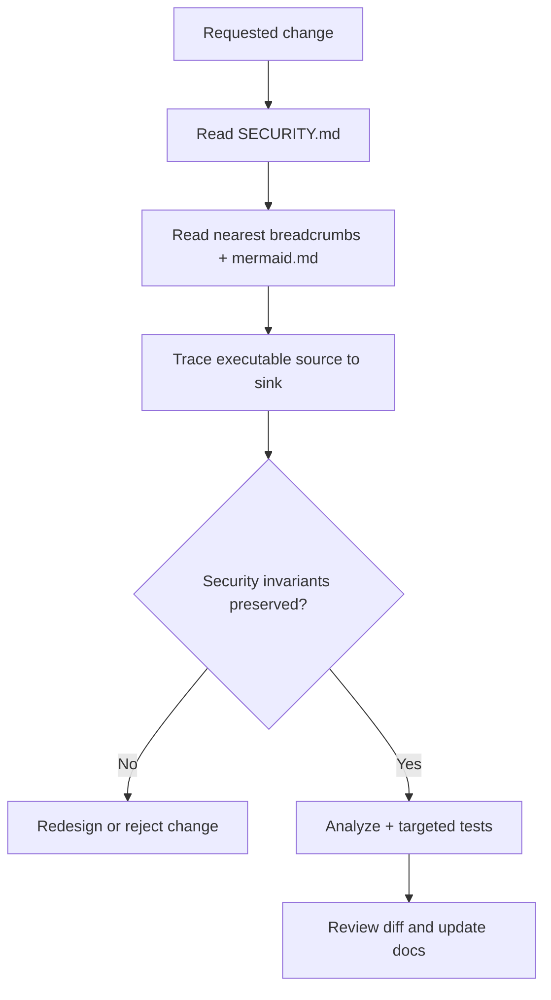

# LLM Context and Security Breadcrumb Schema

Naza One uses visible, reviewable comments to help human maintainers and future language models understand intent. There are no hidden prompts, zero-width instructions, tokenizer tricks, or executable directives embedded in source files.

## Header fields

| Field | Meaning |
|---|---|
| `FILE` | Canonical repository-relative path. |
| `ROLE` | The file's primary responsibility. |
| `DOMAIN` | Architectural ownership area. |
| `SECURITY-INVARIANT` | Property that must remain true after changes. |
| `CHANGE-GUARD` | Minimum review and validation expectations. |
| `DOCS` | Nearest architecture and detailed documentation. |

These comments are context, not authority. Runtime validation, tests, `SECURITY.md`, and current product requirements remain authoritative.

## Trust order for future models

1. User request and repository security policy.
2. Executable behavior and tests.
3. Public interfaces and data-format compatibility.
4. Explicit breadcrumb comments and architecture docs.
5. Historical or generated material.

Never weaken validation merely to make code match a comment. Update stale comments in the same patch as behavior.

