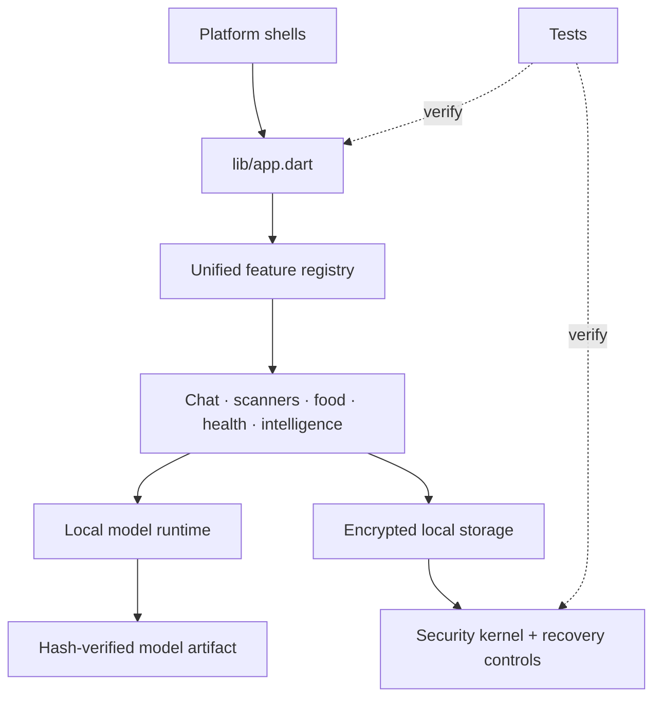

# Mermaid Architecture Index

Each maintained subsystem has a local map:

- [`lib`](../lib/mermaid.md)
- [`lib/chat`](../lib/chat/mermaid.md)
- [`lib/food`](../lib/food/mermaid.md)
- [`lib/memory`](../lib/memory/mermaid.md)
- [`lib/model`](../lib/model/mermaid.md)
- [`lib/navigation`](../lib/navigation/mermaid.md)
- [`lib/onboarding`](../lib/onboarding/mermaid.md)
- [`lib/performance`](../lib/performance/mermaid.md)
- [`lib/scanner`](../lib/scanner/mermaid.md)
- [`lib/security`](../lib/security/mermaid.md)
- [`lib/settings`](../lib/settings/mermaid.md)
- [`lib/theme`](../lib/theme/mermaid.md)
- [`test`](../test/mermaid.md)
- [`test_archive`](../test_archive/mermaid.md)
- [`docs`](../docs/mermaid.md)
- [`tool`](../tool/mermaid.md)
- [`tools`](../tools/mermaid.md)
- [`native`](../native/mermaid.md)
- [`assets`](../assets/mermaid.md)
- [`android`](../android/mermaid.md)
- [`ios`](../ios/mermaid.md)
- [`linux`](../linux/mermaid.md)
- [`macos`](../macos/mermaid.md)
- [`.github`](../.github/mermaid.md)
- [`naza_one_asset_pack`](../naza_one_asset_pack/mermaid.md)

## Repository-wide flow

