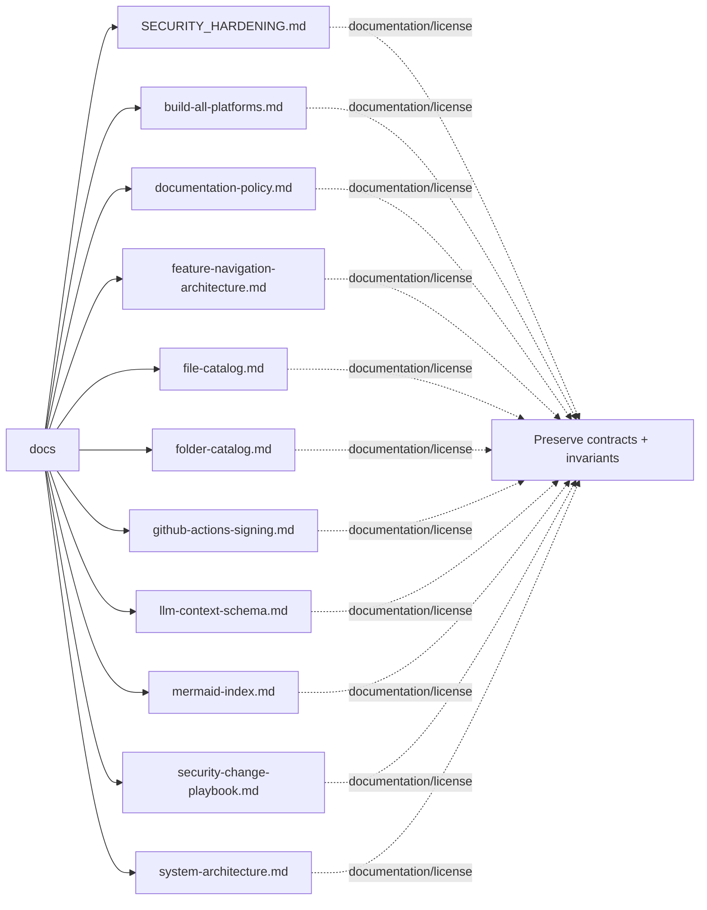

# Architecture Map: `docs`

This map is generated by `tool/generate_architecture_docs.py`. It is a navigation aid; executable code and security policy remain authoritative.

## Files

| File | Classification | Purpose |
|---|---|---|
| [`SECURITY_HARDENING.md`](SECURITY_HARDENING.md#L1) | documentation/license | Human-readable guidance or attribution for SECURITY HARDENING. |
| [`build-all-platforms.md`](build-all-platforms.md#L1) | documentation/license | Human-readable guidance or attribution for build all platforms. |
| [`documentation-policy.md`](documentation-policy.md#L1) | documentation/license | Human-readable guidance or attribution for documentation policy. |
| [`feature-navigation-architecture.md`](feature-navigation-architecture.md#L1) | documentation/license | Human-readable guidance or attribution for feature navigation architecture. |
| [`file-catalog.md`](file-catalog.md#L1) | documentation/license | Human-readable guidance or attribution for file catalog. |
| [`folder-catalog.md`](folder-catalog.md#L1) | documentation/license | Human-readable guidance or attribution for folder catalog. |
| [`github-actions-signing.md`](github-actions-signing.md#L1) | documentation/license | Human-readable guidance or attribution for github actions signing. |
| [`llm-context-schema.md`](llm-context-schema.md#L1) | documentation/license | Human-readable guidance or attribution for llm context schema. |
| [`mermaid-index.md`](mermaid-index.md#L1) | documentation/license | Human-readable guidance or attribution for mermaid index. |
| [`security-change-playbook.md`](security-change-playbook.md#L1) | documentation/license | Human-readable guidance or attribution for security change playbook. |
| [`system-architecture.md`](system-architecture.md#L1) | documentation/license | Human-readable guidance or attribution for system architecture. |

## Change protocol

1. Read the file breadcrumb and `SECURITY.md`.
2. Trace callers, persistence, and async ownership.
3. Preserve bounds and fail-closed behavior.
4. Run analysis and focused tests.
