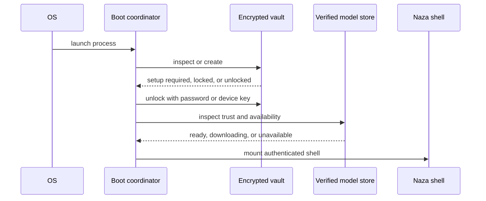
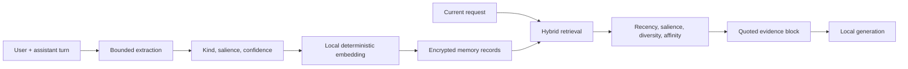
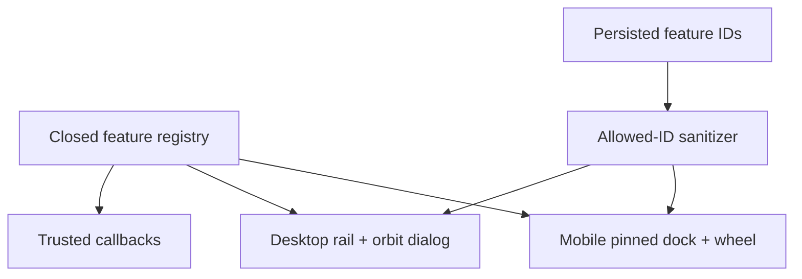
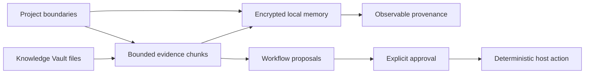

# Naza One System Handbook

This handbook explains Naza One as a connected offline intelligence system. It
is deliberately organized around data flow, authority boundaries, persistence,
and user-visible behavior rather than around isolated screens. The README is a
maintained entry point; this document is the long-form reference for engineers,
reviewers, testers, and future language-model-assisted maintenance.

## 1. Product model

Naza One is a local-first Flutter workstation. “Local-first” is an architectural
property, not a marketing adjective: the normal path keeps prompts, responses,
images, memories, documents, settings, health records, manuscripts, and recovery
metadata on the user’s device. The application can contain network-assisted
transport for model acquisition and explicitly configured provider integrations,
but those paths are separate from the default local inference path.

The product has four cooperating layers:

1. **The shell** owns lifecycle, themes, routing, feature discovery, model
   readiness, and panel composition.
2. **The intelligence layer** owns local Gemma execution, context retrieval,
   document evidence, projects, provenance, and approval-gated proposals.
3. **The secure state layer** owns encrypted SQLite records, key wrapping,
   device unlock, recovery, rollback protection, and auditability.
4. **Feature modules** implement chat, vision, food, health, garden, road,
   BookForge, games, exploration, settings, and backups.

The important design rule is that no model output becomes authority merely by
being plausible. A model can suggest text, a move, a workflow, a classification,
or a plan. Deterministic host code validates and commits state changes.

## 2. Repository map

The executable path begins in `lib/main.dart`. The boot coordinator establishes
the vault-first lifecycle and then mounts `NazaOneApp`. The large application
shell remains in `lib/app.dart` because it owns cross-feature orchestration; new
subsystems should be factored into focused folders and connected through narrow
callbacks rather than adding more unrelated state to the shell.

Important folders:

| Area | Responsibility |
| --- | --- |
| `lib/chat` | Conversation history, metadata, drawer behavior, scroll following |
| `lib/chess` | Deterministic chess reducer and Gemma opponent contract |
| `lib/food` | Fridge, shelf, recipes, bake, safety, and food persistence |
| `lib/games` | Games portfolio and game surfaces |
| `lib/intelligence` | Knowledge Vault, Memory Observatory, Projects, workflows |
| `lib/memory` | Embedded vector store and local memory service |
| `lib/model` | Model preference, trust, runtime profile, mirrors, downloading |
| `lib/navigation` | Closed feature registry, unified mobile wheel, desktop rail |
| `lib/security` | Encrypted database, recovery, audit, rollback, trust policy |
| `lib/settings` | Runtime and Smart Memory settings cards |
| `lib/theme` | Theme catalog and appearance controls |
| `test` | Widget, security, archive, food, model, and regression tests |

Every meaningful folder should keep a nearby `mermaid.md` map. Mermaid maps are
architecture aids, not executable configuration. They must never be used as a
secret prompt channel or as a substitute for code-level security invariants.

## 3. Startup and lifecycle

The startup sequence is intentionally staged:



Vault-first means user data is not exposed while model setup is incomplete. A
model download can fail without destroying the vault. A locked vault can make
the Intelligence panel show a recovery state without crashing the Flutter
isolate. Async initialization must always catch errors at its UI boundary.

On pause, background, hidden, or detached lifecycle events, active generation
is cancelled or allowed to settle according to the runtime contract. Detached
shutdown persists bounded drafts and locks the vault when the process owns the
authenticated session.

## 4. Secure state and authority

`NazaSecureDatabase` is the durable source of truth for application records. It
protects logical record identifiers and values with authenticated encryption.
SQLite metadata such as schema shape, row counts, and ciphertext sizes may still
be observable; the system does not claim page-level database encryption.

The secure database API is deliberately narrow:

- `readJson(namespace, key)` reads one authenticated record;
- `writeJson(namespace, key, value)` writes one authenticated record;
- `delete(namespace, key)` deletes one record;
- import/export paths are budgeted and transactional where supported;
- the database refuses ordinary reads while locked.

Shared preferences are not a second database for sensitive content. Preferences
may hold non-sensitive UI hints where the feature explicitly allows it, but
manuscript text, embedded media, memories, API keys, recovery material, and
document evidence belong in the encrypted vault.

The authority chain is:

```text
user action
  -> typed UI intent
  -> bounded host validation
  -> security authorization when privileged
  -> deterministic mutation
  -> encrypted persistence
  -> audit/provenance update
```

The model is not in this chain as an authority. Model output enters as untrusted
data. Prompt injection defenses therefore protect the model context, while host
validation protects the actual state transition.

## 5. Model runtime

The default model is local Gemma through LiteRT-LM. The model artifact is
identified by immutable revision, expected byte count, part hashes, and final
SHA-256. Download transport can vary; artifact identity cannot.

The runtime lifecycle has these states conceptually:

- not installed;
- downloading;
- verifying;
- trusted cached model ready;
- runtime initializing;
- ready;
- CPU fallback;
- unavailable or failed.

Generation calls are bounded by input size, continuation count, image limits,
timeouts, and cancellation. Streaming UI updates should update only the active
message notifier where possible instead of rebuilding the entire shell for each
token. A provider adapter must never log API keys, raw sensitive prompts, or
unbounded response bodies.

Remote-compatible providers are opt-in integrations. Custom endpoints require
HTTPS and an explicit origin/provider policy before an API key may be sent.
Endpoint text is not itself an authorization grant.

## 6. Chat, memory, and retrieval

Chat persists encrypted history separately from vector memory. History preserves
conversation continuity; memory stores bounded, potentially reusable evidence.
The two stores have different retention and clearing semantics.

The local memory pipeline is:



Retrieved memory is quoted evidence. Instructions inside retrieved text are not
commands. Current user intent and direct observations outrank stale memory.
Memory allocation is bounded by candidate count, retrieved chunk count, context
characters, and timeouts. A retrieval miss is not evidence that something never
happened.

The Memory Observatory exposes a safe projection: evidence text, role, route,
importance, access count, and timestamp. It does not expose embeddings or
internal retrieval controls. Forgetting a memory removes the encrypted record
and refreshes the projection.

## 7. Knowledge Vault

The Knowledge Vault is project-scoped local evidence storage. It accepts bounded
files through `file_picker` without eagerly materializing arbitrary picker bytes.
The current foundation supports safe text-oriented ingestion, including Markdown,
plain text, CSV, JSON, receipts, and manuals represented as text. Future PDF or
DOCX extraction must preserve compressed-size, expanded-size, entry-count,
individual-entry, XML, and media budgets before materialization.

Each document records:

- stable content-derived identifier;
- project identifier;
- bounded display name and type;
- byte count;
- SHA-256;
- bounded decoded text;
- import timestamp.

The document is persisted in the encrypted vault and indexed into local memory
as project-tagged evidence. Importing a document does not execute its contents,
interpret its text as policy, or grant it workflow permissions.

A future full RAG layer should add chunk-level document identifiers and retrieval
links, not replace the existing memory authority model. Every answer should be
able to distinguish current request, memory, document evidence, image input, and
model-generated inference.

## 8. Projects and boundaries

Projects prevent accidental context leakage. A project is a local namespace for
documents, workflow proposals, artifacts, and eventually conversation threads.
The current project record contains a bounded name, description, identifier, and
last-update timestamp.

Project identifiers are data selectors, not executable paths. They must be
validated against the closed in-process registry or encrypted project records.
Persisted IDs never carry callbacks, providers, file commands, or authorization
objects.

When project-aware retrieval expands, the default query must include the active
project scope. Cross-project retrieval should be an explicit user setting and
must be visible in provenance. A project switch should invalidate or rebuild
context that was scoped to the prior project; stale results must not silently
bleed across namespaces.

## 9. Workflow Builder

Workflow Builder is intentionally proposal-first. A workflow contains a project
scope, title, bounded instruction, and approval state. The model may propose a
workflow such as “compare this month’s bills,” but deterministic host code must
still decide which files, transformations, and outputs are allowed.

A safe workflow lifecycle is:

```text
draft -> validate -> preview inputs -> user approval -> deterministic run
                                      \-> reject or edit
```

No workflow should run merely because it was generated, imported, or marked as a
favorite. External side effects require separate capability checks and should
default to preview-only. File writes should be atomic and recoverable. Network
operations should be explicit, origin restricted, and separately auditable.

## 10. Unified navigation

The shell owns one closed feature registry. Mobile presents a compact pinned
dock and opens a draggable wheel. Desktop presents the same registry as a rail
and an all-features dialog. The registry is the source of truth for labels,
icons, categories, selection, pinning, and callbacks.



Persisted pins are IDs only. Chat is required and remains pinned. Default pins
are Chatbot, Road Scanner, and Food Scanner; users may replace secondary pins
within the configured maximum. A failed save restores the prior in-memory list.
The rail and mobile drawer wait for persisted pins before accepting pin edits.

The wheel supports category filtering, text search, horizontal swipe, tap to
open, and long press to pin. Feature-specific tabs such as medication sections
remain content controls, not competing application-level navbars. This prevents
the Food surface, BookForge, and shell from presenting conflicting primary
navigation systems.

## 11. Feature library

### Chatbot

Chat is the default surface. It streams local responses, supports bounded image
attachments, maintains encrypted thread history, and provides cancellation.
Memory retrieval is advisory and quoted. The composer should remain responsive
while generation is active.

### Road scanner

Road scanning accepts explicit location/context and image evidence. Results are
observations with uncertainty, not an autonomous driving authority. Drafts and
results are bounded and persisted through encrypted state.

### Food and Kitchen

Food includes fridge capture, shelf inventory, recipe generation, bake lab, food
safety, planner workflows, and more advanced kitchen tools. The global wheel
opens Recipes, Fridge, Shelf, and Food More directly. Food no longer owns a
competing application navbar.

### Garden and exploration

Garden supports plant identification, mushroom identification, multi-image
bounded capture, garden logging, growth/size estimates, health signals, and
charts. FindIt, Drive, Predict, and Heart Flow require explicit fields such as
location or identity rather than silently inferring missing inputs.

### HealthDash

HealthDash contains schedules, medications, dental, exercise, recovery, meals,
meal planning, body goals, groceries, intelligence, and walking. Health output
is supportive guidance and structured reflection; it is not diagnosis or an
emergency service.

### BookForge

BookForge provides local manuscripts, Markdown preview, bounded DOCX/media
handling, per-document autosave, repository import, secure publishing metadata,
and local generation. Large documents must be chunked and saved per document;
the whole library must not be rewritten on every keystroke.

### Games

Games are listed through a games portfolio. Chess uses a deterministic local
rules reducer. Gemma receives only the current board, side to move, and exact
legal allowlist for opponent actions. The reducer validates the action before
committing it. RGB/entropy telemetry may inform candidate diversity but never
authorizes a move.

### Settings, backup, and recovery

Settings exposes themes, models, providers, memory, personalities, backup,
recovery, and security state. Backups should contain encrypted vault material,
not casually decrypted exports. Recovery artifacts are separated, bounded, and
explicitly user-controlled.

## 12. Performance rules

Flutter’s UI isolate must not perform large synchronous work during gestures or
streaming. The profiler’s Build, Layout, Paint, Raster, and Shader phases are
different failure classes.

For Build/Layout stalls:

- cache immutable registries and static descriptors;
- use `const` widgets where possible;
- avoid rebuilding the entire shell for a single streaming token;
- avoid creating large lists before they enter a lazy viewport;
- keep panel caches intentional and bounded;
- do not perform encryption, JSON serialization, file reads, or model work in
  `build()`.

For Raster/Shader stalls:

- avoid large translucent overlays and expensive blur on software rendering;
- use `RepaintBoundary` around independent animated or image-heavy surfaces;
- warm shaders only when the selected renderer benefits from it;
- measure profile/release mode rather than diagnosing from debug timings alone.

When switching BookForge documents, save the prior document asynchronously,
cancel stale work, load the next document lazily, and never rebuild every image
or preview page synchronously.

## 13. Error handling

Every async UI operation follows this pattern:

1. mark the operation busy;
2. capture a generation/request token if stale results are possible;
3. perform bounded work;
4. check `mounted` and token identity;
5. commit state or show a recoverable error;
6. clear busy state in `finally`.

Initialization callbacks must catch failures themselves. A `try/finally` that
clears a spinner is not enough if the exception escapes the async task. Panels
that depend on secure state should show “locked/unavailable” and a retry path.

Errors shown to users should explain the next safe action without leaking keys,
paths, stack traces, plaintext vault content, or provider responses.

## 14. Testing strategy

Run analyzer first:

```bash
flutter analyze --no-pub
```

Then run focused tests for the changed subsystem, followed by smoke coverage:

```bash
flutter test --no-pub test/unified_feature_drawer_test.dart
flutter test --no-pub test/naza_app_smoke_test.dart
```

Security-sensitive changes should also run archive, food, PQ, recovery, audit,
release trust, and model distribution tests. Tests should cover failure paths,
not only successful UI taps:

- locked vault;
- malformed encrypted record;
- rejected file size/hash;
- cancelled picker;
- stale async result;
- failed pin persistence;
- invalid project ID;
- rejected workflow approval;
- model output with illegal action;
- corrupt resumed download;
- provider endpoint outside the allowed origin.

Widget tests should use semantic labels and stable keys instead of fragile text
matching where a navigation label may legitimately change. When a navbar is
removed, update the test to follow the user-visible replacement path, as the
Food More smoke test now opens the unified feature wheel.

## 15. Security review checklist

Before merging a change, ask:

- Does any sensitive value reach preferences, logs, analytics, or an error text?
- Can a malformed file allocate unbounded memory or disk space?
- Does a custom endpoint receive a secret without origin policy?
- Can a model output trigger a privileged mutation without deterministic checks?
- Is a project boundary enforced in retrieval and persistence?
- Are async mutations transactional or reconciled after partial failure?
- Does rollback protection cover new schema identities and version floors?
- Are release actions and dependencies reproducibly pinned?
- Can a failed initialization escape and kill the UI isolate?
- Can stale work overwrite a newer user action?

The complete security playbook and finding history live in `SECURITY.md`,
`docs/security-change-playbook.md`, and the security subsystem maps. This
handbook is descriptive; those files remain authoritative for security policy.

## 16. Documentation maintenance

Documentation must describe actual code, not aspirational features. When a
feature changes, update its nearest folder map, the feature registry description,
the relevant README section, and at least one behavior test. Avoid hidden LLM
tokens, invisible Unicode instructions, or comments that attempt to override
repository policy. Use visible invariants, stable names, bounded contracts, and
Mermaid diagrams that a human can review.

The preferred documentation breadcrumb for a new subsystem is:

```text
feature source
  -> public contract
  -> data owner
  -> security invariant
  -> UI entry point
  -> failure states
  -> focused tests
  -> mermaid architecture map
```

## 17. Roadmap connections

The four intelligence capabilities are intentionally non-local:



The next safe expansions are document chunk provenance, project-scoped chat
threads, artifact versioning, explainable answer context, and deterministic
workflow runners. Each should extend the existing authority chain instead of
creating a parallel memory store, provider path, or navigation system.

## 18. Practical contributor workflow

Start by locating the data owner and the existing public contract. Read the
nearest `SKILL.md` if a repository skill applies. Inspect current changes before
editing. Use `apply_patch` for local edits. Preserve unrelated worktree changes.
Implement the smallest coherent boundary, then run formatter, analyzer, focused
tests, and smoke tests. Report what changed, what was measured, and what remains
out of scope.

Do not use destructive cleanup commands on the workspace. Do not treat a green
widget test as proof of cryptographic correctness. Do not claim a feature is
fully local if a configured provider can receive it. Do not claim “AI safety”
when the actual property is narrower, such as a reducer validating an action.

Naza One remains strongest when its ambitious feature set is held together by
boring, explicit boundaries: encrypted state, bounded inputs, deterministic
reducers, visible provenance, one navigation registry, recoverable failures,
and tests that exercise the cases most likely to be forgotten.
