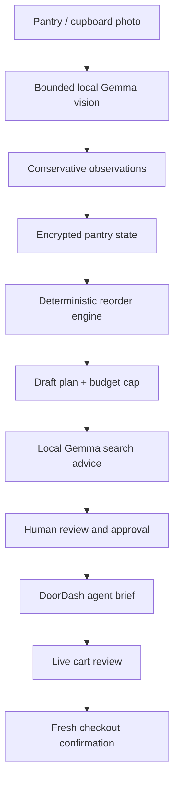

# Pantry Autopilot and DoorDash CLI bridge

## What the DoorDash announcement establishes

DoorDash announced `dd-cli` as a limited beta in July 2026. Public reporting
describes three consumer-commerce capabilities: store search, deal discovery,
and checkout from an AI agent. Access is waitlist-gated for developers in the
United States and Canada on macOS. The public announcement does not document a
stable command grammar, machine-readable capability manifest, authentication
contract, or checkout flags.

Naza One therefore does not guess commands. It treats `dd-cli` as a capability
boundary:

1. On macOS it may run only the non-purchasing `--version` and `--help` probes.
2. It creates a bounded JSON agent brief from an approved replenishment plan.
3. The user can copy that brief into an agent with official beta access.
4. The brief requires the agent to display the live merchant, variants,
   substitutions, taxes, fees, tip, delivery-address summary, and final total.
5. A fresh user confirmation is required after that display and immediately
   before checkout.

This keeps the integration useful today without encoding an imaginary beta
API. A direct executor can be added behind `DoorDashOrderingGateway` after
DoorDash publishes or supplies an official command contract.

## Local-first workflow

The photo model may observe food, beverages, paper products, cleaning supplies,
personal-care items, and pet supplies. A missing object is never interpreted as
consumed or absent because a single photo can be cropped or occluded. Newly
observed items start with automatic replenishment disabled until the user
verifies the item, quantity, target, reorder point, daily-use estimate, and
price estimate.

## Planning model

For an enabled item \(i\), the deterministic target is:

\[
T_i = \max(\text{configured target}_i,\;
           \text{daily use}_i \times \text{planning horizon})
\]

The candidate quantity is:

\[
Q_i = \max(0,\; T_i - \text{observed quantity}_i)
\]

An item becomes a candidate only when it is at or below its configured reorder
point, or its estimated days remaining is within the configured lead time.
Known price estimates are accumulated in urgency order. A line that would
exceed the budget cap is left visible but deselected. Unknown-price lines remain
visible and require verification because silently dropping an essential would
be worse than presenting an incomplete estimate.

When an item has a configured daily-use rate, the planner first projects the
remaining quantity from the elapsed time since that item was last observed.
That projection allows the system to anticipate depletion between scheduled
photo scans without pretending it has live sensor data.

Gemma does not own these quantities, selection flags, or budget decisions. Its
advisory pass can produce bounded DoorDash search phrases, optional
substitutions when allowed, and review warnings. It cannot mutate a cart or
authorize payment.

## Encrypted data

`EncryptedPantryRepository` stores inventory policy, observations, and up to 50
order-plan records in the existing authenticated Naza vault under the
`pantry-autopilot-v1` namespace. DoorDash credentials, payment data, exact
delivery addresses, and CLI authentication material are not stored in pantry
records or sent to the local model.

## Extension point

The ordering boundary is the `DoorDashOrderingGateway` interface. A future
official adapter should:

- use a version-pinned, documented DoorDash command contract;
- pass arguments as an array with shell execution disabled;
- parse a strict machine-readable response;
- separate search/cart mutation from checkout;
- bind approval to the exact final cart and total;
- reject expired approval, merchant changes, substitutions, address changes,
  or total increases;
- preserve an audit receipt without storing payment credentials.

No model output should ever be evaluated as a shell command.

## Research sources

- [TechCrunch: “Yes, you can now order DoorDash from the command line”](https://techcrunch.com/2026/07/16/yes-you-can-now-order-doordash-from-the-command-line/)
- [DoorDash Developer Services](https://developer.doordash.com/)
