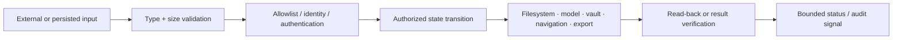

# Security Change Playbook

Use this checklist when modifying persistence, recovery, model acquisition, navigation, image handling, or native/platform boundaries.

## Source-to-sink review

For each changed path, document:

1. Who controls the input?
2. What exact size, type, format, freshness, and identity checks apply?
3. Is failure closed, recoverable, and non-destructive?
4. Can cancellation or process interruption leave ambiguous state?
5. Does any error expose secrets, personal content, paths, or key material?
6. Is the final side effect authenticated or read back before old state is retired?

## High-risk invariants

- Never deserialize a callback, route, class name, filesystem destination, or cryptographic algorithm choice from user preferences.
- Never treat transport success as model identity; verify immutable size and digest.
- Never substitute defaults after authentication, signature, tag, or recovery parsing failure.
- Never persist passwords, raw unlock secrets, plaintext recovery keys, or unbounded private content in logs.
- Never classify missing scanner evidence as a safe result.
- Never let image bytes exceed the shared vision bound or survive longer than their owning workflow requires.
- Never modify generated platform files when the same change belongs in a source template or build setting.

## Required validation

Run `flutter analyze` and the focused tests for the changed domain. Security-format, KDF, model identity, recovery, and migration changes require explicit regression vectors and compatibility review.
