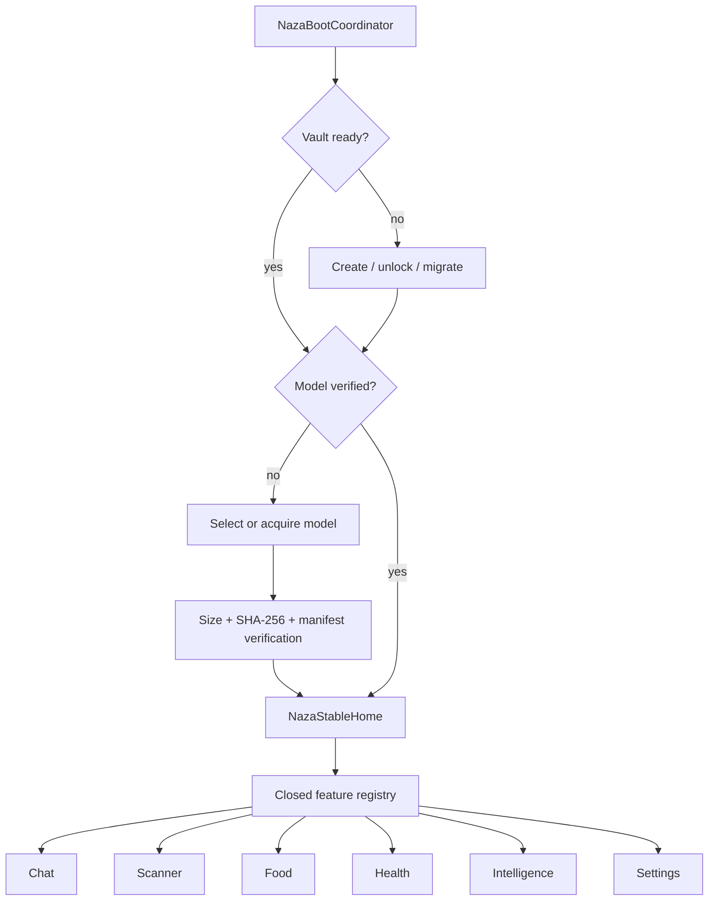
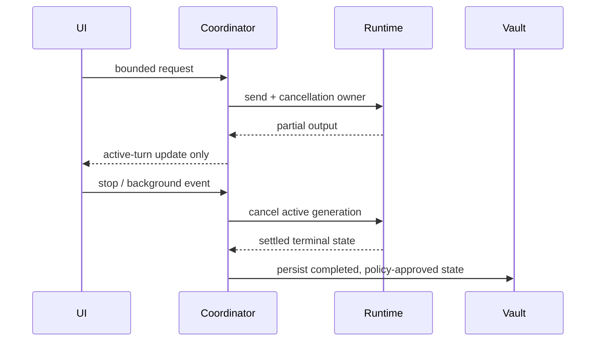

# Naza One System Architecture

## Runtime ownership

`lib/app.dart` is the composition root for the mature application shell. Smaller modules own bounded domains, but encrypted storage, model lifecycle, cancellation, and cross-feature navigation remain centralized so the app does not accidentally create competing authorities.

## Data classes

| Data | Authority | Persistence | Boundary |
|---|---|---|---|
| Conversation/history | Chat coordinator + vault | Authenticated encrypted records | User input and model output are untrusted text. |
| Scanner drafts/results | Scanner surface + vault | Authenticated encrypted records | Evidence and generated classification remain distinct. |
| Food records | Food repository | Encrypted repository | Images and parsed model output are bounded and validated. |
| Health state | Health vault adapter | Secure database | Medical features remain non-diagnostic and fail closed when locked. |
| Feature pins | Navigation pin policy | Non-sensitive preferences | IDs are allowlisted; callbacks are never deserialized. |
| Model artifact | Model trust policy | Public file + encrypted attestation | Bytes are untrusted until exact identity verification. |

## Async ownership

The UI must not outlive controllers, issue duplicate model turns, persist incomplete security state, or infer success from a cancelled operation.
