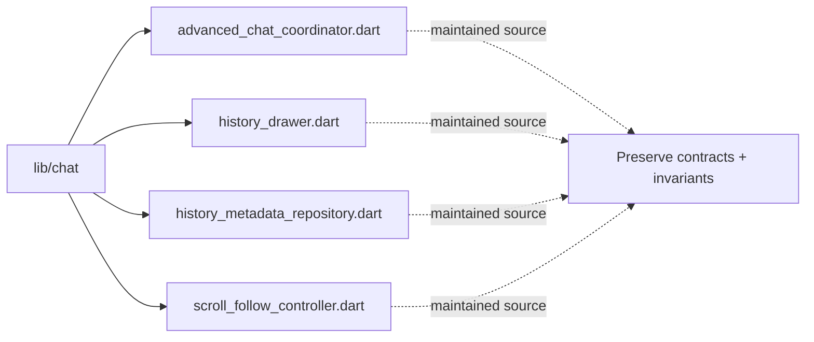

# Architecture Map: `lib/chat`

This map is generated by `tool/generate_architecture_docs.py`. It is a navigation aid; executable code and security policy remain authoritative.

## Files

| File | Classification | Purpose |
|---|---|---|
| [`advanced_chat_coordinator.dart`](advanced_chat_coordinator.dart#L1) | maintained source | Dart implementation or verification surface for advanced chat coordinator. |
| [`history_drawer.dart`](history_drawer.dart#L1) | maintained source | Dart implementation or verification surface for history drawer. |
| [`history_metadata_repository.dart`](history_metadata_repository.dart#L1) | maintained source | Dart implementation or verification surface for history metadata repository. |
| [`scroll_follow_controller.dart`](scroll_follow_controller.dart#L1) | maintained source | Dart implementation or verification surface for scroll follow controller. |

## Change protocol

1. Read the file breadcrumb and `SECURITY.md`.
2. Trace callers, persistence, and async ownership.
3. Preserve bounds and fail-closed behavior.
4. Run analysis and focused tests.
