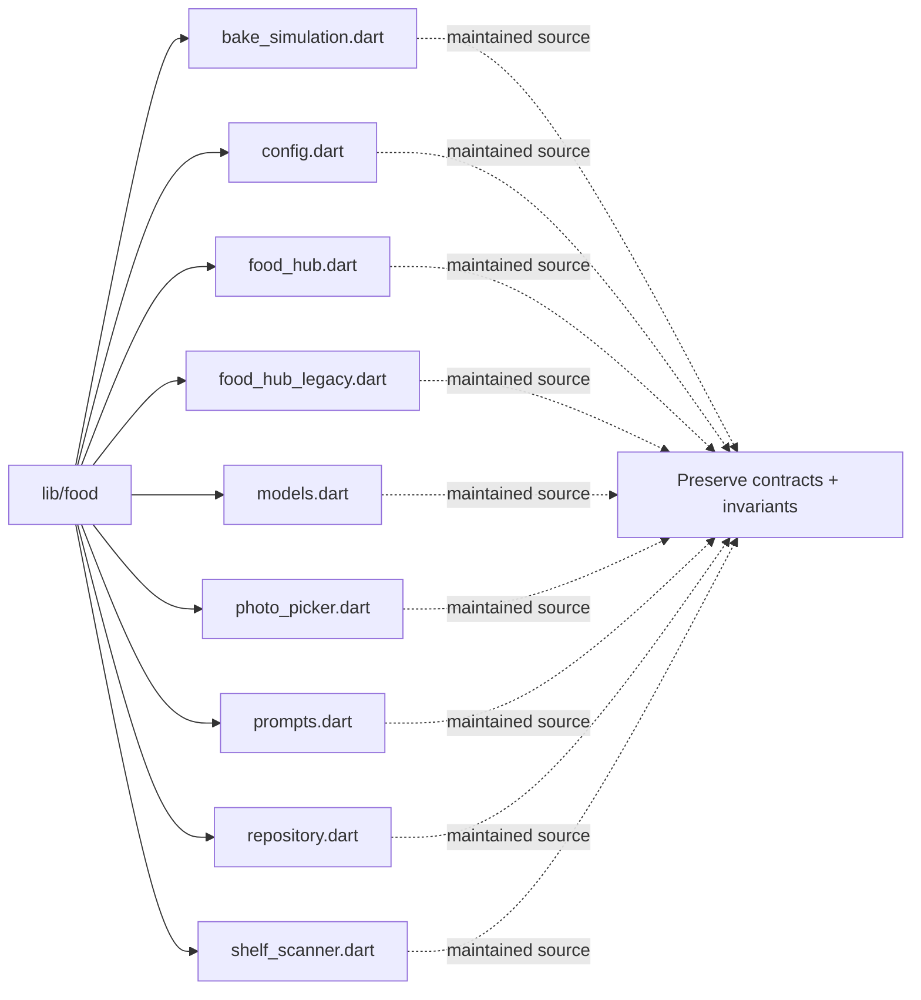

# Architecture Map: `lib/food`

This map is generated by `tool/generate_architecture_docs.py`. It is a navigation aid; executable code and security policy remain authoritative.

## Files

| File | Classification | Purpose |
|---|---|---|
| [`bake_simulation.dart`](bake_simulation.dart#L1) | maintained source | Dart implementation or verification surface for bake simulation. |
| [`config.dart`](config.dart#L1) | maintained source | Dart implementation or verification surface for config. |
| [`food_hub.dart`](food_hub.dart#L1) | maintained source | Dart implementation or verification surface for food hub. |
| [`food_hub_legacy.dart`](food_hub_legacy.dart#L1) | maintained source | Dart implementation or verification surface for food hub legacy. |
| [`models.dart`](models.dart#L1) | maintained source | Dart implementation or verification surface for models. |
| [`photo_picker.dart`](photo_picker.dart#L1) | maintained source | Dart implementation or verification surface for photo picker. |
| [`prompts.dart`](prompts.dart#L1) | maintained source | Dart implementation or verification surface for prompts. |
| [`repository.dart`](repository.dart#L1) | maintained source | Dart implementation or verification surface for repository. |
| [`shelf_scanner.dart`](shelf_scanner.dart#L1) | maintained source | Dart implementation or verification surface for shelf scanner. |

## Change protocol

1. Read the file breadcrumb and `SECURITY.md`.
2. Trace callers, persistence, and async ownership.
3. Preserve bounds and fail-closed behavior.
4. Run analysis and focused tests.
