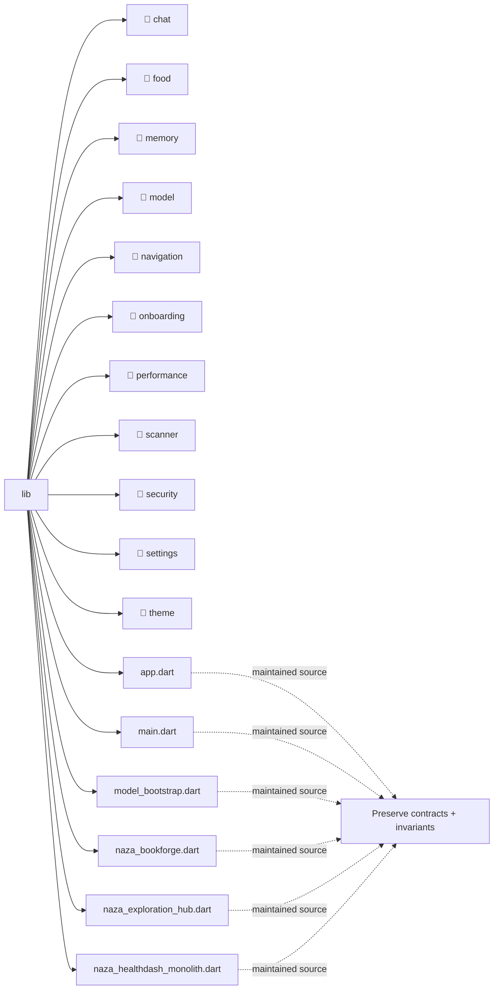

# Architecture Map: `lib`

This map is generated by `tool/generate_architecture_docs.py`. It is a navigation aid; executable code and security policy remain authoritative.

## Files

| File | Classification | Purpose |
|---|---|---|
| [`app.dart`](app.dart#L1) | maintained source | Dart implementation or verification surface for app. |
| [`main.dart`](main.dart#L1) | maintained source | Dart implementation or verification surface for main. |
| [`model_bootstrap.dart`](model_bootstrap.dart#L1) | maintained source | Dart implementation or verification surface for model bootstrap. |
| [`naza_bookforge.dart`](naza_bookforge.dart#L1) | maintained source | Dart implementation or verification surface for naza bookforge. |
| [`naza_exploration_hub.dart`](naza_exploration_hub.dart#L1) | maintained source | Dart implementation or verification surface for naza exploration hub. |
| [`naza_healthdash_monolith.dart`](naza_healthdash_monolith.dart#L1) | maintained source | Dart implementation or verification surface for naza healthdash monolith. |

## Change protocol

1. Read the file breadcrumb and `SECURITY.md`.
2. Trace callers, persistence, and async ownership.
3. Preserve bounds and fail-closed behavior.
4. Run analysis and focused tests.
