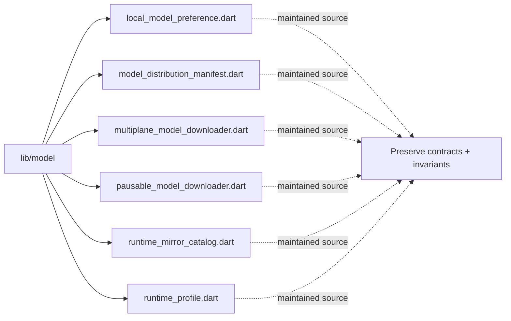

# Architecture Map: `lib/model`

This map is generated by `tool/generate_architecture_docs.py`. It is a navigation aid; executable code and security policy remain authoritative.

## Files

| File | Classification | Purpose |
|---|---|---|
| [`local_model_preference.dart`](local_model_preference.dart#L1) | maintained source | Dart implementation or verification surface for local model preference. |
| [`model_distribution_manifest.dart`](model_distribution_manifest.dart#L1) | maintained source | Dart implementation or verification surface for model distribution manifest. |
| [`multiplane_model_downloader.dart`](multiplane_model_downloader.dart#L1) | maintained source | Dart implementation or verification surface for multiplane model downloader. |
| [`pausable_model_downloader.dart`](pausable_model_downloader.dart#L1) | maintained source | Dart implementation or verification surface for pausable model downloader. |
| [`runtime_mirror_catalog.dart`](runtime_mirror_catalog.dart#L1) | maintained source | Dart implementation or verification surface for runtime mirror catalog. |
| [`runtime_profile.dart`](runtime_profile.dart#L1) | maintained source | Dart implementation or verification surface for runtime profile. |

## Change protocol

1. Read the file breadcrumb and `SECURITY.md`.
2. Trace callers, persistence, and async ownership.
3. Preserve bounds and fail-closed behavior.
4. Run analysis and focused tests.
