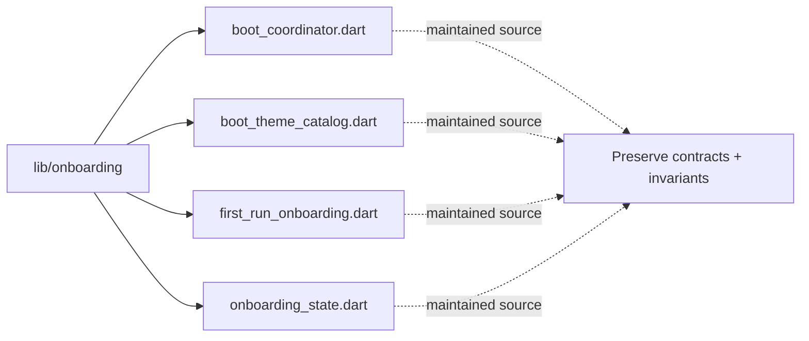

# Architecture Map: `lib/onboarding`

This map is generated by `tool/generate_architecture_docs.py`. It is a navigation aid; executable code and security policy remain authoritative.

## Files

| File | Classification | Purpose |
|---|---|---|
| [`boot_coordinator.dart`](boot_coordinator.dart#L1) | maintained source | Dart implementation or verification surface for boot coordinator. |
| [`boot_theme_catalog.dart`](boot_theme_catalog.dart#L1) | maintained source | Dart implementation or verification surface for boot theme catalog. |
| [`first_run_onboarding.dart`](first_run_onboarding.dart#L1) | maintained source | Dart implementation or verification surface for first run onboarding. |
| [`onboarding_state.dart`](onboarding_state.dart#L1) | maintained source | Dart implementation or verification surface for onboarding state. |

## Change protocol

1. Read the file breadcrumb and `SECURITY.md`.
2. Trace callers, persistence, and async ownership.
3. Preserve bounds and fail-closed behavior.
4. Run analysis and focused tests.
