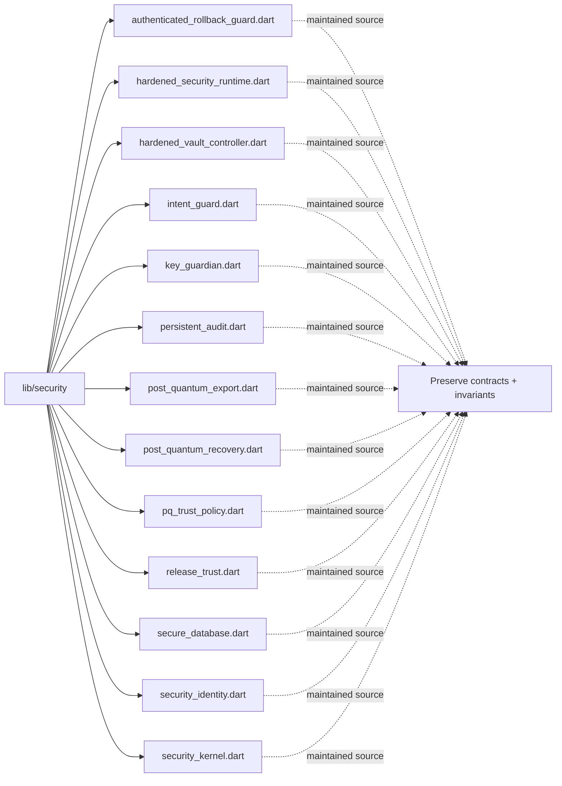

# Architecture Map: `lib/security`

This map is generated by `tool/generate_architecture_docs.py`. It is a navigation aid; executable code and security policy remain authoritative.

## Files

| File | Classification | Purpose |
|---|---|---|
| [`authenticated_rollback_guard.dart`](authenticated_rollback_guard.dart#L1) | maintained source | Dart implementation or verification surface for authenticated rollback guard. |
| [`hardened_security_runtime.dart`](hardened_security_runtime.dart#L1) | maintained source | Dart implementation or verification surface for hardened security runtime. |
| [`hardened_vault_controller.dart`](hardened_vault_controller.dart#L1) | maintained source | Dart implementation or verification surface for hardened vault controller. |
| [`intent_guard.dart`](intent_guard.dart#L1) | maintained source | Dart implementation or verification surface for intent guard. |
| [`key_guardian.dart`](key_guardian.dart#L1) | maintained source | Dart implementation or verification surface for key guardian. |
| [`persistent_audit.dart`](persistent_audit.dart#L1) | maintained source | Dart implementation or verification surface for persistent audit. |
| [`post_quantum_export.dart`](post_quantum_export.dart#L1) | maintained source | Dart implementation or verification surface for post quantum export. |
| [`post_quantum_recovery.dart`](post_quantum_recovery.dart#L1) | maintained source | Dart implementation or verification surface for post quantum recovery. |
| [`pq_trust_policy.dart`](pq_trust_policy.dart#L1) | maintained source | Dart implementation or verification surface for pq trust policy. |
| [`release_trust.dart`](release_trust.dart#L1) | maintained source | Dart implementation or verification surface for release trust. |
| [`secure_database.dart`](secure_database.dart#L1) | maintained source | Dart implementation or verification surface for secure database. |
| [`security_identity.dart`](security_identity.dart#L1) | maintained source | Dart implementation or verification surface for security identity. |
| [`security_kernel.dart`](security_kernel.dart#L1) | maintained source | Dart implementation or verification surface for security kernel. |

## Change protocol

1. Read the file breadcrumb and `SECURITY.md`.
2. Trace callers, persistence, and async ownership.
3. Preserve bounds and fail-closed behavior.
4. Run analysis and focused tests.
