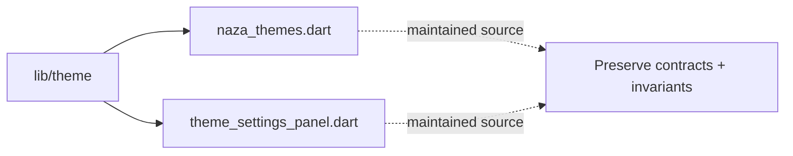

# Architecture Map: `lib/theme`

This map is generated by `tool/generate_architecture_docs.py`. It is a navigation aid; executable code and security policy remain authoritative.

## Files

| File | Classification | Purpose |
|---|---|---|
| [`naza_themes.dart`](naza_themes.dart#L1) | maintained source | Dart implementation or verification surface for naza themes. |
| [`theme_settings_panel.dart`](theme_settings_panel.dart#L1) | maintained source | Dart implementation or verification surface for theme settings panel. |

## Change protocol

1. Read the file breadcrumb and `SECURITY.md`.
2. Trace callers, persistence, and async ownership.
3. Preserve bounds and fail-closed behavior.
4. Run analysis and focused tests.
