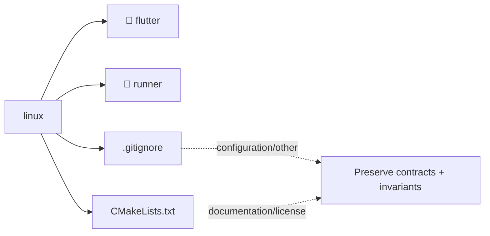

# Architecture Map: `linux`

This map is generated by `tool/generate_architecture_docs.py`. It is a navigation aid; executable code and security policy remain authoritative.

## Files

| File | Classification | Purpose |
|---|---|---|
| [`.gitignore`](.gitignore#L1) | configuration/other | Configuration/Other surface for .gitignore. |
| [`CMakeLists.txt`](CMakeLists.txt#L1) | documentation/license | Human-readable guidance or attribution for CMakeLists. |

## Change protocol

1. Read the file breadcrumb and `SECURITY.md`.
2. Trace callers, persistence, and async ownership.
3. Preserve bounds and fail-closed behavior.
4. Run analysis and focused tests.
