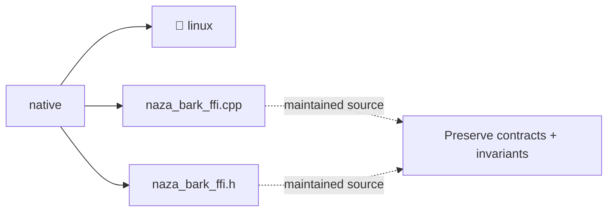

# Architecture Map: `native`

This map is generated by `tool/generate_architecture_docs.py`. It is a navigation aid; executable code and security policy remain authoritative.

## Files

| File | Classification | Purpose |
|---|---|---|
| [`naza_bark_ffi.cpp`](naza_bark_ffi.cpp#L1) | maintained source | Maintained Source surface for naza bark ffi. |
| [`naza_bark_ffi.h`](naza_bark_ffi.h#L1) | maintained source | Maintained Source surface for naza bark ffi. |

## Change protocol

1. Read the file breadcrumb and `SECURITY.md`.
2. Trace callers, persistence, and async ownership.
3. Preserve bounds and fail-closed behavior.
4. Run analysis and focused tests.
