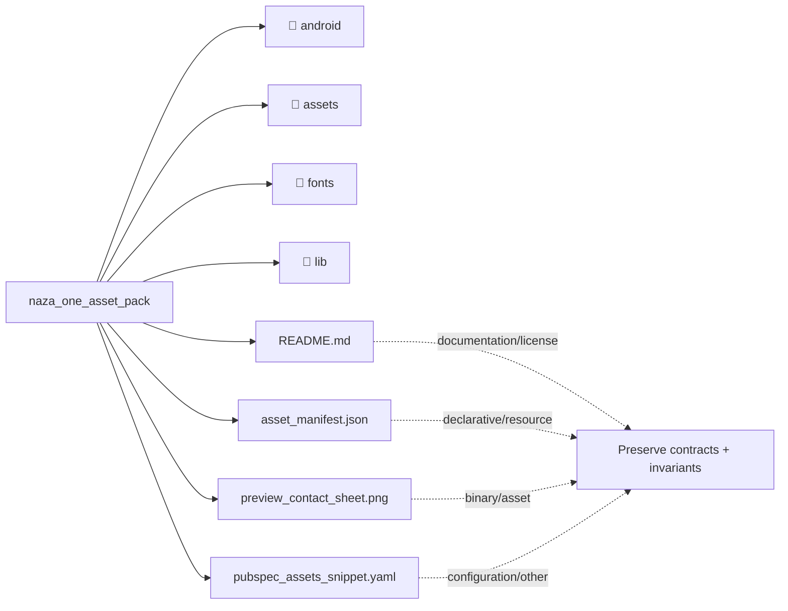

# Architecture Map: `naza_one_asset_pack`

This map is generated by `tool/generate_architecture_docs.py`. It is a navigation aid; executable code and security policy remain authoritative.

## Files

| File | Classification | Purpose |
|---|---|---|
| [`README.md`](README.md#L1) | documentation/license | Human-readable guidance or attribution for README. |
| [`asset_manifest.json`](asset_manifest.json#L1) | declarative/resource | Declarative/Resource surface for asset manifest. |
| [`preview_contact_sheet.png`](preview_contact_sheet.png#L1) | binary/asset | Runtime or presentation asset: preview contact sheet. |
| [`pubspec_assets_snippet.yaml`](pubspec_assets_snippet.yaml#L1) | configuration/other | Configuration/Other surface for pubspec assets snippet. |

## Change protocol

1. Read the file breadcrumb and `SECURITY.md`.
2. Trace callers, persistence, and async ownership.
3. Preserve bounds and fail-closed behavior.
4. Run analysis and focused tests.
