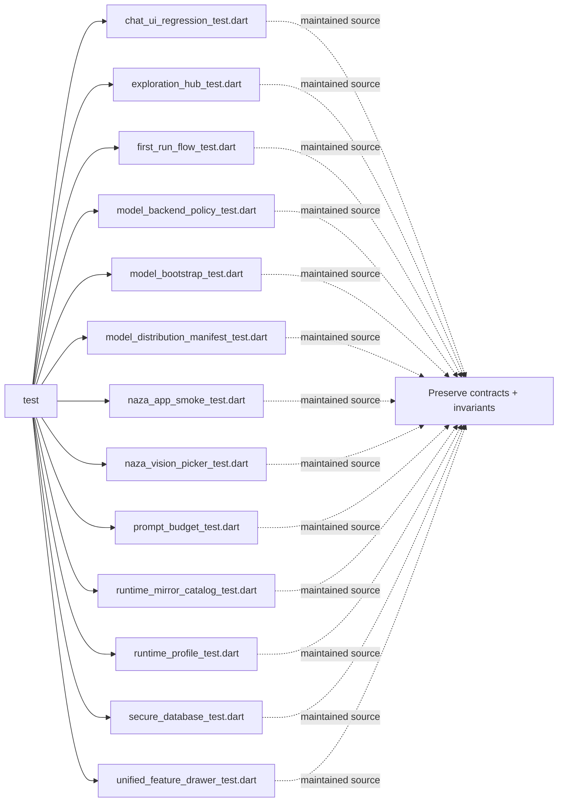

# Architecture Map: `test`

This map is generated by `tool/generate_architecture_docs.py`. It is a navigation aid; executable code and security policy remain authoritative.

## Files

| File | Classification | Purpose |
|---|---|---|
| [`chat_ui_regression_test.dart`](chat_ui_regression_test.dart#L1) | maintained source | Dart implementation or verification surface for chat ui regression test. |
| [`exploration_hub_test.dart`](exploration_hub_test.dart#L1) | maintained source | Dart implementation or verification surface for exploration hub test. |
| [`first_run_flow_test.dart`](first_run_flow_test.dart#L1) | maintained source | Dart implementation or verification surface for first run flow test. |
| [`model_backend_policy_test.dart`](model_backend_policy_test.dart#L1) | maintained source | Dart implementation or verification surface for model backend policy test. |
| [`model_bootstrap_test.dart`](model_bootstrap_test.dart#L1) | maintained source | Dart implementation or verification surface for model bootstrap test. |
| [`model_distribution_manifest_test.dart`](model_distribution_manifest_test.dart#L1) | maintained source | Dart implementation or verification surface for model distribution manifest test. |
| [`naza_app_smoke_test.dart`](naza_app_smoke_test.dart#L1) | maintained source | Dart implementation or verification surface for naza app smoke test. |
| [`naza_vision_picker_test.dart`](naza_vision_picker_test.dart#L1) | maintained source | Dart implementation or verification surface for naza vision picker test. |
| [`prompt_budget_test.dart`](prompt_budget_test.dart#L1) | maintained source | Dart implementation or verification surface for prompt budget test. |
| [`runtime_mirror_catalog_test.dart`](runtime_mirror_catalog_test.dart#L1) | maintained source | Dart implementation or verification surface for runtime mirror catalog test. |
| [`runtime_profile_test.dart`](runtime_profile_test.dart#L1) | maintained source | Dart implementation or verification surface for runtime profile test. |
| [`secure_database_test.dart`](secure_database_test.dart#L1) | maintained source | Dart implementation or verification surface for secure database test. |
| [`unified_feature_drawer_test.dart`](unified_feature_drawer_test.dart#L1) | maintained source | Dart implementation or verification surface for unified feature drawer test. |

## Change protocol

1. Read the file breadcrumb and `SECURITY.md`.
2. Trace callers, persistence, and async ownership.
3. Preserve bounds and fail-closed behavior.
4. Run analysis and focused tests.
