# Architecture Map: `test_archive`

This map is generated by `tool/generate_architecture_docs.py`. It is a navigation aid; executable code and security policy remain authoritative.

```mermaid
flowchart LR
    ROOT["test_archive"]

    ROOT --> Ntest_archive_README_md["README.md"]
    Ntest_archive_README_md -. "documentation/license" .-> CONTRACT["Preserve contracts + invariants"]
    ROOT --> Ntest_archive_advanced_chat_coordinator_test_dart["advanced_chat_coordinator_test.dart"]
    Ntest_archive_advanced_chat_coordinator_test_dart -. "maintained source" .-> CONTRACT["Preserve contracts + invariants"]
    ROOT --> Ntest_archive_advanced_chat_features_test_dart["advanced_chat_features_test.dart"]
    Ntest_archive_advanced_chat_features_test_dart -. "maintained source" .-> CONTRACT["Preserve contracts + invariants"]
    ROOT --> Ntest_archive_embedded_vector_store_test_dart["embedded_vector_store_test.dart"]
    Ntest_archive_embedded_vector_store_test_dart -. "maintained source" .-> CONTRACT["Preserve contracts + invariants"]
    ROOT --> Ntest_archive_food_repository_test_dart["food_repository_test.dart"]
    Ntest_archive_food_repository_test_dart -. "maintained source" .-> CONTRACT["Preserve contracts + invariants"]
    ROOT --> Ntest_archive_food_vision_logic_test_dart["food_vision_logic_test.dart"]
    Ntest_archive_food_vision_logic_test_dart -. "maintained source" .-> CONTRACT["Preserve contracts + invariants"]
    ROOT --> Ntest_archive_hardened_security_runtime_test_dart["hardened_security_runtime_test.dart"]
    Ntest_archive_hardened_security_runtime_test_dart -. "maintained source" .-> CONTRACT["Preserve contracts + invariants"]
    ROOT --> Ntest_archive_hardened_vault_controller_test_dart["hardened_vault_controller_test.dart"]
    Ntest_archive_hardened_vault_controller_test_dart -. "maintained source" .-> CONTRACT["Preserve contracts + invariants"]
    ROOT --> Ntest_archive_history_continuation_test_dart["history_continuation_test.dart"]
    Ntest_archive_history_continuation_test_dart -. "maintained source" .-> CONTRACT["Preserve contracts + invariants"]
    ROOT --> Ntest_archive_history_metadata_repository_test_dart["history_metadata_repository_test.dart"]
    Ntest_archive_history_metadata_repository_test_dart -. "maintained source" .-> CONTRACT["Preserve contracts + invariants"]
    ROOT --> Ntest_archive_intent_guard_test_dart["intent_guard_test.dart"]
    Ntest_archive_intent_guard_test_dart -. "maintained source" .-> CONTRACT["Preserve contracts + invariants"]
    ROOT --> Ntest_archive_key_guardian_test_dart["key_guardian_test.dart"]
    Ntest_archive_key_guardian_test_dart -. "maintained source" .-> CONTRACT["Preserve contracts + invariants"]
    ROOT --> Ntest_archive_legacy_migration_test_dart["legacy_migration_test.dart"]
    Ntest_archive_legacy_migration_test_dart -. "maintained source" .-> CONTRACT["Preserve contracts + invariants"]
    ROOT --> Ntest_archive_local_memory_service_test_dart["local_memory_service_test.dart"]
    Ntest_archive_local_memory_service_test_dart -. "maintained source" .-> CONTRACT["Preserve contracts + invariants"]
    ROOT --> Ntest_archive_model_attestation_test_dart["model_attestation_test.dart"]
    Ntest_archive_model_attestation_test_dart -. "maintained source" .-> CONTRACT["Preserve contracts + invariants"]
    ROOT --> Ntest_archive_naza_quantum_router_test_dart["naza_quantum_router_test.dart"]
    Ntest_archive_naza_quantum_router_test_dart -. "maintained source" .-> CONTRACT["Preserve contracts + invariants"]
    ROOT --> Ntest_archive_naza_themes_test_dart["naza_themes_test.dart"]
    Ntest_archive_naza_themes_test_dart -. "maintained source" .-> CONTRACT["Preserve contracts + invariants"]
    ROOT --> Ntest_archive_persistent_audit_test_dart["persistent_audit_test.dart"]
    Ntest_archive_persistent_audit_test_dart -. "maintained source" .-> CONTRACT["Preserve contracts + invariants"]
    ROOT --> Ntest_archive_post_quantum_export_test_dart["post_quantum_export_test.dart"]
    Ntest_archive_post_quantum_export_test_dart -. "maintained source" .-> CONTRACT["Preserve contracts + invariants"]
    ROOT --> Ntest_archive_post_quantum_recovery_test_dart["post_quantum_recovery_test.dart"]
    Ntest_archive_post_quantum_recovery_test_dart -. "maintained source" .-> CONTRACT["Preserve contracts + invariants"]
    ROOT --> Ntest_archive_post_quantum_state_test_dart["post_quantum_state_test.dart"]
    Ntest_archive_post_quantum_state_test_dart -. "maintained source" .-> CONTRACT["Preserve contracts + invariants"]
    ROOT --> Ntest_archive_pq_trust_policy_test_dart["pq_trust_policy_test.dart"]
    Ntest_archive_pq_trust_policy_test_dart -. "maintained source" .-> CONTRACT["Preserve contracts + invariants"]
    ROOT --> Ntest_archive_release_trust_test_dart["release_trust_test.dart"]
    Ntest_archive_release_trust_test_dart -. "maintained source" .-> CONTRACT["Preserve contracts + invariants"]
    ROOT --> Ntest_archive_security_kernel_test_dart["security_kernel_test.dart"]
    Ntest_archive_security_kernel_test_dart -. "maintained source" .-> CONTRACT["Preserve contracts + invariants"]
    ROOT --> Ntest_archive_shelf_scanner_test_dart["shelf_scanner_test.dart"]
    Ntest_archive_shelf_scanner_test_dart -. "maintained source" .-> CONTRACT["Preserve contracts + invariants"]
```

## Files

| File | Classification | Purpose |
|---|---|---|
| [`README.md`](README.md#L1) | documentation/license | Human-readable guidance or attribution for README. |
| [`advanced_chat_coordinator_test.dart`](advanced_chat_coordinator_test.dart#L1) | maintained source | Dart implementation or verification surface for advanced chat coordinator test. |
| [`advanced_chat_features_test.dart`](advanced_chat_features_test.dart#L1) | maintained source | Dart implementation or verification surface for advanced chat features test. |
| [`embedded_vector_store_test.dart`](embedded_vector_store_test.dart#L1) | maintained source | Dart implementation or verification surface for embedded vector store test. |
| [`food_repository_test.dart`](food_repository_test.dart#L1) | maintained source | Dart implementation or verification surface for food repository test. |
| [`food_vision_logic_test.dart`](food_vision_logic_test.dart#L1) | maintained source | Dart implementation or verification surface for food vision logic test. |
| [`hardened_security_runtime_test.dart`](hardened_security_runtime_test.dart#L1) | maintained source | Dart implementation or verification surface for hardened security runtime test. |
| [`hardened_vault_controller_test.dart`](hardened_vault_controller_test.dart#L1) | maintained source | Dart implementation or verification surface for hardened vault controller test. |
| [`history_continuation_test.dart`](history_continuation_test.dart#L1) | maintained source | Dart implementation or verification surface for history continuation test. |
| [`history_metadata_repository_test.dart`](history_metadata_repository_test.dart#L1) | maintained source | Dart implementation or verification surface for history metadata repository test. |
| [`intent_guard_test.dart`](intent_guard_test.dart#L1) | maintained source | Dart implementation or verification surface for intent guard test. |
| [`key_guardian_test.dart`](key_guardian_test.dart#L1) | maintained source | Dart implementation or verification surface for key guardian test. |
| [`legacy_migration_test.dart`](legacy_migration_test.dart#L1) | maintained source | Dart implementation or verification surface for legacy migration test. |
| [`local_memory_service_test.dart`](local_memory_service_test.dart#L1) | maintained source | Dart implementation or verification surface for local memory service test. |
| [`model_attestation_test.dart`](model_attestation_test.dart#L1) | maintained source | Dart implementation or verification surface for model attestation test. |
| [`naza_quantum_router_test.dart`](naza_quantum_router_test.dart#L1) | maintained source | Dart implementation or verification surface for naza quantum router test. |
| [`naza_themes_test.dart`](naza_themes_test.dart#L1) | maintained source | Dart implementation or verification surface for naza themes test. |
| [`persistent_audit_test.dart`](persistent_audit_test.dart#L1) | maintained source | Dart implementation or verification surface for persistent audit test. |
| [`post_quantum_export_test.dart`](post_quantum_export_test.dart#L1) | maintained source | Dart implementation or verification surface for post quantum export test. |
| [`post_quantum_recovery_test.dart`](post_quantum_recovery_test.dart#L1) | maintained source | Dart implementation or verification surface for post quantum recovery test. |
| [`post_quantum_state_test.dart`](post_quantum_state_test.dart#L1) | maintained source | Dart implementation or verification surface for post quantum state test. |
| [`pq_trust_policy_test.dart`](pq_trust_policy_test.dart#L1) | maintained source | Dart implementation or verification surface for pq trust policy test. |
| [`release_trust_test.dart`](release_trust_test.dart#L1) | maintained source | Dart implementation or verification surface for release trust test. |
| [`security_kernel_test.dart`](security_kernel_test.dart#L1) | maintained source | Dart implementation or verification surface for security kernel test. |
| [`shelf_scanner_test.dart`](shelf_scanner_test.dart#L1) | maintained source | Dart implementation or verification surface for shelf scanner test. |

## Change protocol

1. Read the file breadcrumb and `SECURITY.md`.
2. Trace callers, persistence, and async ownership.
3. Preserve bounds and fail-closed behavior.
4. Run analysis and focused tests.
