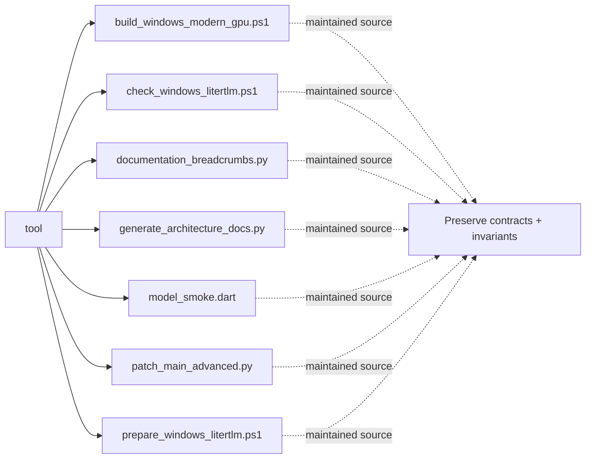

# Architecture Map: `tool`

This map is generated by `tool/generate_architecture_docs.py`. It is a navigation aid; executable code and security policy remain authoritative.

## Files

| File | Classification | Purpose |
|---|---|---|
| [`build_windows_modern_gpu.ps1`](build_windows_modern_gpu.ps1#L1) | maintained source | Maintained Source surface for build windows modern gpu. |
| [`check_windows_litertlm.ps1`](check_windows_litertlm.ps1#L1) | maintained source | Maintained Source surface for check windows litertlm. |
| [`documentation_breadcrumbs.py`](documentation_breadcrumbs.py#L1) | maintained source | Maintained Source surface for documentation breadcrumbs. |
| [`generate_architecture_docs.py`](generate_architecture_docs.py#L1) | maintained source | Maintained Source surface for generate architecture docs. |
| [`model_smoke.dart`](model_smoke.dart#L1) | maintained source | Dart implementation or verification surface for model smoke. |
| [`patch_main_advanced.py`](patch_main_advanced.py#L1) | maintained source | Maintained Source surface for patch main advanced. |
| [`prepare_windows_litertlm.ps1`](prepare_windows_litertlm.ps1#L1) | maintained source | Maintained Source surface for prepare windows litertlm. |

## Change protocol

1. Read the file breadcrumb and `SECURITY.md`.
2. Trace callers, persistence, and async ownership.
3. Preserve bounds and fail-closed behavior.
4. Run analysis and focused tests.
