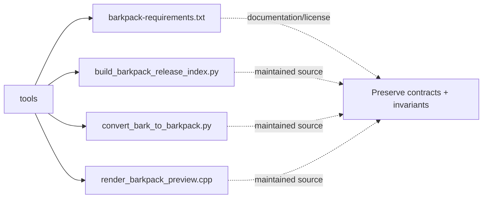

# Architecture Map: `tools`

This map is generated by `tool/generate_architecture_docs.py`. It is a navigation aid; executable code and security policy remain authoritative.

## Files

| File | Classification | Purpose |
|---|---|---|
| [`barkpack-requirements.txt`](barkpack-requirements.txt#L1) | documentation/license | Human-readable guidance or attribution for barkpack requirements. |
| [`build_barkpack_release_index.py`](build_barkpack_release_index.py#L1) | maintained source | Maintained Source surface for build barkpack release index. |
| [`convert_bark_to_barkpack.py`](convert_bark_to_barkpack.py#L1) | maintained source | Maintained Source surface for convert bark to barkpack. |
| [`render_barkpack_preview.cpp`](render_barkpack_preview.cpp#L1) | maintained source | Maintained Source surface for render barkpack preview. |

## Change protocol

1. Read the file breadcrumb and `SECURITY.md`.
2. Trace callers, persistence, and async ownership.
3. Preserve bounds and fail-closed behavior.
4. Run analysis and focused tests.
